# Hi there 👋

 
 
 
 
 

## 🚀 Some places I've been

- 🦎 [GEICO](https://www.geico.com/tech/)
-  [Apple](https://apple.com)
- 💬 [Google](https://google.com)
- :speech_balloon: [Jibe Mobile](http://jibemobile.com/)
- ☎️ [Verizon Media](https://www.verizonmedia.com/)
- 📱 [Appcelerator](https://appcelerator.com)
- 🔨 [SourceForge](http://sourceforge.net) (the original)

## 🔭 I’m currently working on

- 🛻 [1971 Toyota Landcruiser (FJ40)](http://project-fj.com/)
- :bricks: [LEGO](https://brickset.com/sets/ownedby-fusion94)

## 💬 Previous things I've working on

- :cloud: [iCloud](https://www.apple.com/iCloud)
- [Siri/AIML](https://www.apple.com/siri/)

## 📫 How to reach me:

- :unlock: Unsecure - fusion94@gmail.com
- :closed_lock_with_key: Secure - guntharp@damagelabs.io
- 👾 [Personal Website](https://www.fusion94.org/)
- :spiral_notepad: [LinkedIn](https://www.linkedin.com/in/fusion94/)

<!--
**fusion94/fusion94** is a ✨ _special_ ✨ repository because its `README.md` (this file) appears on your GitHub profile.

Here are some ideas to get you started:

- 🔭 I’m currently working on ...
- 🌱 I’m currently learning ...
- 👯 I’m looking to collaborate on ...
- 🤔 I’m looking for help with ...
- 💬 Ask me about ...
- 📫 How to reach me: ...
- 😄 Pronouns: ...
- ⚡ Fun fact: ...
-->
