# Hi there 👋

📊 GitHub Stats

 

 
 
 
 
 
 

## 🛠 Tech Stack

## 🚀 Some places I've been

- 🦎 [GEICO](https://www.geico.com/tech/)
- 🍎 [Apple](https://apple.com)
- 💬 [Google](https://google.com)
- 💬 [Jibe Mobile](http://jibemobile.com/)
- ☎️ [Verizon Media](https://www.verizonmedia.com/)
- 📱 [Appcelerator](https://appcelerator.com)
- 🔨 [SourceForge](http://sourceforge.net) (the original)

## 🔭 I'm currently working on

- 🛻 [1971 Toyota Landcruiser (FJ40)](http://project-fj.com/)
- 🧱 [LEGO](https://brickset.com/sets/ownedby-fusion94)

## 🌱 Currently learning

- 🦀 [Rust](https://www.rust-lang.org/)
- 🐹 [Go](https://go.dev/)

## 💬 Previous things I've been working on

- ☁️ [iCloud](https://www.apple.com/iCloud)
- 🗣️ [Siri/AIML](https://www.apple.com/siri/)

## 📰 Latest Blog Posts

<!-- BLOG-POST-LIST:START -->

<!-- BLOG-POST-LIST:END -->

## 📫 How to reach me

