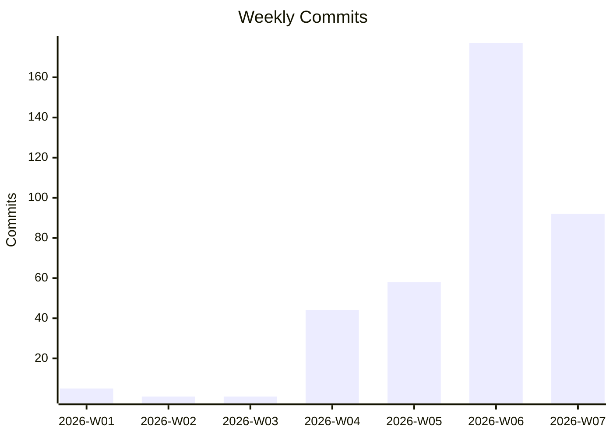
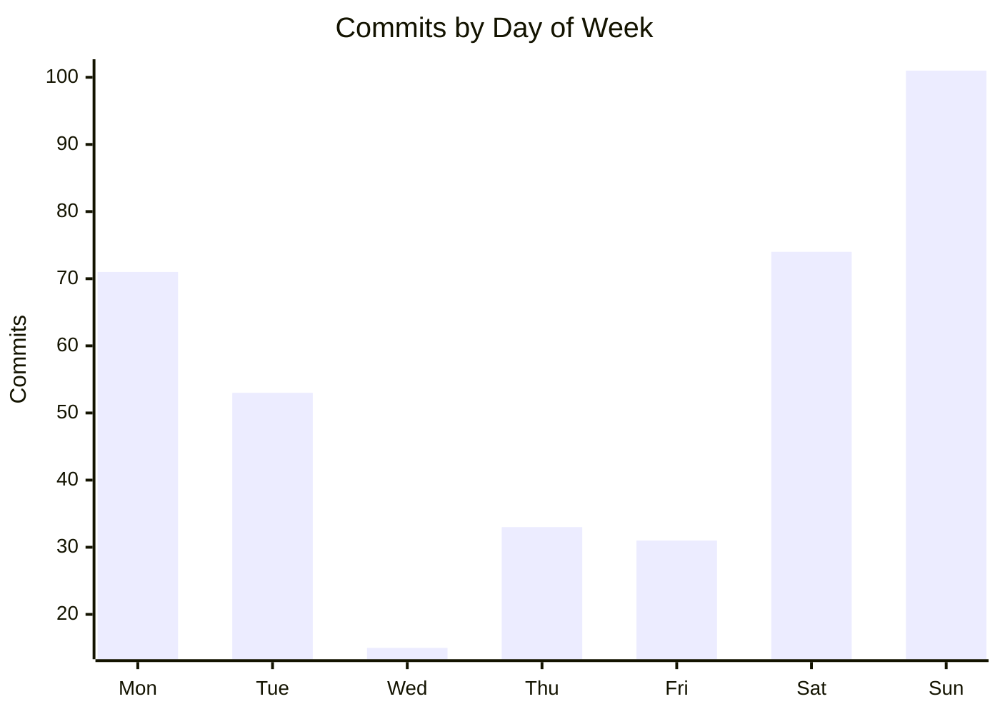
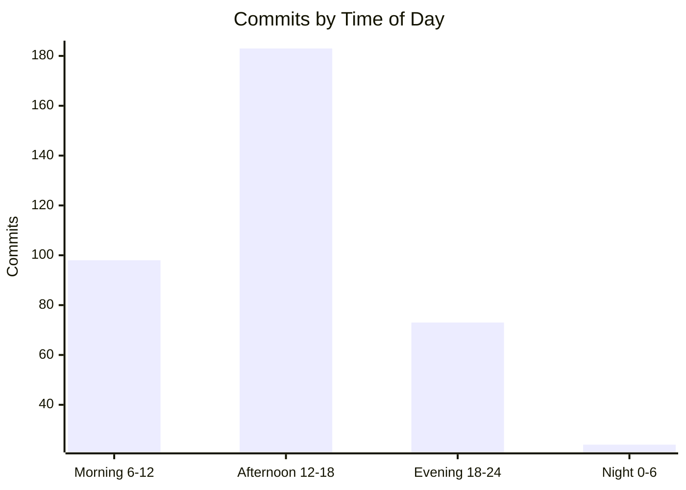
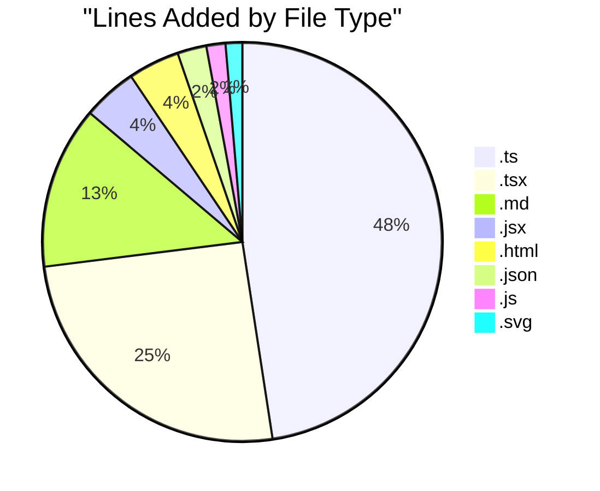

# Code Statistics Report

## 1. Executive Summary

From **2026-01-01** to **2026-02-10** (41 days), across 20 repositories, there were **378** commits with **111,801** lines added and **50,532** lines removed. **whiskey-canon** was the most active project with 107 commits. A total of **123** PRs were merged and **141** issues were created across GitHub-hosted repos.

## 2. Summary Table

| Metric | Value |
|--------|-------|
| Total Commits | 378 |
| Lines Added | 111,801 |
| Lines Removed | 50,532 |
| Net Lines | +61,269 |
| Merged PRs | 123 |
| Issues Created | 141 |
| Issues Closed | 47 |

## 3. Test vs Application Code Breakdown

| Category | Lines Added | % Added | Lines Removed | % Removed |
|----------|------------|---------|---------------|-----------|
| Application Code | 89,674 | 80.2% | 48,830 | 96.6% |
| Test Code | 22,127 | 19.8% | 1,702 | 3.4% |
| **Total** | **111,801** | **100%** | **50,532** | **100%** |

## 4. Weekly Velocity

| Week | Commits |
|------|---------|
| 2026-W01 | 5 |
| 2026-W02 | 1 |
| 2026-W03 | 1 |
| 2026-W04 | 44 |
| 2026-W05 | 58 |
| 2026-W06 | 177 |
| 2026-W07 | 92 |

## 5. Activity Patterns

### Day of Week Distribution

| Day | Commits |
|-----|---------|
| Monday | 71 |
| Tuesday | 53 |
| Wednesday | 15 |
| Thursday | 33 |
| Friday | 31 |
| Saturday | 74 |
| Sunday | 101 |

### Time of Day Distribution

| Time Bucket | Commits |
|-------------|---------|
| Morning (6-12) | 98 |
| Afternoon (12-18) | 183 |
| Evening (18-24) | 73 |
| Night (0-6) | 24 |

**Longest commit streak:** 19 consecutive days
**Average commits per day:** 9.4
**Average commits per week:** 66.1

## 6. Repository Breakdown

| Repository | Commits | App Lines +/- | Test Lines +/- | Net Change | Test % | Merged PRs | Issues Created | Issues Closed | Bus Factor |
|------------|---------|---------------|----------------|------------|--------|------------|----------------|---------------|------------|
| whiskey-canon | 107 | +16,242/-3,095 | +12,221/-1,194 | +24,174 | 42.9% | 42 | 51 | 17 | 1 of 2 |
| fusion94 | 76 | +2,662/-1,020 | +0/-0 | +1,642 | 0.0% | 0 | 0 | 0 | 2 of 2 |
| whiskey-canon-blinds | 60 | +32,115/-1,172 | +3,269/-16 | +34,196 | 9.2% | 52 | 1 | 0 | 1 of 1 |
| sports-card-tracker | 54 | +5,554/-1,644 | +6,637/-171 | +10,376 | 54.4% | 7 | 32 | 7 | 1 of 1 |
| cellar-sync | 27 | +6,284/-4,243 | +0/-0 | +2,041 | 0.0% | 3 | 33 | 1 | 1 of 1 |
| rims | 24 | +12,407/-33,512 | +0/-321 | -21,426 | 0.0% | 19 | 24 | 22 | 1 of 1 |
| sh-underground | 14 | +5,519/-535 | +0/-0 | +4,984 | 0.0% | 0 | 0 | 0 | 1 of 1 |
| StringAlong | 9 | +1,063/-36 | +0/-0 | +1,027 | 0.0% | 0 | 0 | 0 | 1 of 2 |
| fusion94.org | 4 | +6,021/-3,388 | +0/-0 | +2,633 | 0.0% | 0 | 0 | 0 | 1 of 1 |
| damagelabs-www | 2 | +1,679/-9 | +0/-0 | +1,670 | 0.0% | 0 | 0 | 0 | 1 of 1 |
| collectorsplaybook | 1 | +128/-176 | +0/-0 | -48 | 0.0% | 0 | 0 | 0 | 1 of 1 |

## 7. Code Quality Signals

| Repository | Avg PR Size (lines) | Commit-to-PR Ratio | Flag |
|------------|--------------------|--------------------|------|
| whiskey-canon | 915 | 2.5 |  :warning: Large PRs |
| fusion94 | N/A | N/A | No merged PRs |
| whiskey-canon-blinds | 898 | 1.2 |  :warning: Large PRs |
| sports-card-tracker | 341402 | 7.7 |  :warning: Large PRs |
| cellar-sync | 6336 | 9.0 |  :warning: Large PRs |
| rims | 3566 | 1.3 |  :warning: Large PRs |
| sh-underground | N/A | N/A | No merged PRs |
| StringAlong | N/A | N/A | No merged PRs |
| fusion94.org | N/A | N/A | No merged PRs |
| damagelabs-www | N/A | N/A | No merged PRs |
| collectorsplaybook | N/A | N/A | No merged PRs |

### High-Churn Files (Rework Indicator)

| Repository | File | Commits | Lines Added | Lines Removed |
|------------|------|---------|-------------|---------------|
| fusion94 | profile/stats.svg | 39 | 420 | 158 |
| fusion94 | profile/streak.svg | 37 | 130 | 54 |
| fusion94 | README.md | 19 | 105 | 80 |
| fusion94 | .github/workflows/grs.yml | 19 | 135 | 44 |
| whiskey-canon-blinds | server/src/routes/auth.ts | 18 | 1,700 | 226 |
| whiskey-canon-blinds | src/services/api.ts | 15 | 1,449 | 60 |
| whiskey-canon-blinds | server/src/index.ts | 12 | 172 | 20 |
| whiskey-canon-blinds | server/src/db/index.ts | 12 | 513 | 2 |
| whiskey-canon-blinds | server/src/db/schema.ts | 11 | 334 | 9 |
| whiskey-canon-blinds | CHANGELOG.md | 11 | 246 | 23 |
| whiskey-canon-blinds | package.json | 11 | 92 | 4 |
| whiskey-canon | backend/src/index.ts | 10 | 92 | 36 |
| whiskey-canon | backend/src/routes/auth.test.ts | 10 | 1,162 | 309 |
| whiskey-canon | backend/src/test/setup.ts | 10 | 225 | 5 |
| cellar-sync | docs/ROADMAP.md | 9 | 1,075 | 730 |

## 8. Collaboration Metrics

| Repository | Avg PR Turnaround | Avg Comments/PR | Unique Reviewers | Weighted Bus Factor |
|------------|-------------------|-----------------|------------------|---------------------|
| whiskey-canon | 46m | 0.6 | 2 | 1 of 2 |
| whiskey-canon-blinds | 1m | 0.0 | 0 | 1 of 1 |
| sports-card-tracker | 2.0h | 0.0 | 0 | 1 of 1 |
| cellar-sync | 1m | 0.0 | 0 | 1 of 1 |
| rims | 4m | 0.0 | 0 | 1 of 1 |

## 9. Issue Activity

| Repository | Issues Created | Issues Closed | Close Rate | Avg Resolution Time | Flag |
|------------|----------------|---------------|------------|---------------------|------|
| whiskey-canon | 51 | 17 | 33.3% | 5.6 days |  :warning: Low close rate |
| whiskey-canon-blinds | 1 | 0 | 0.0% | N/A |  :warning: Low close rate |
| sports-card-tracker | 32 | 7 | 21.9% | 17.5h |  :warning: Low close rate |
| cellar-sync | 33 | 1 | 3.0% | 25m |  :warning: Low close rate |
| rims | 24 | 22 | 91.7% | 837.9 days |  |

## 10. Repo Health Dashboard

| Repository | Last Commit | Open Issues | Open PRs | Branches | Flag |
|------------|-------------|-------------|----------|----------|------|
| Go-FilamentSamples | 2025-06-17 | 0 | 0 | 3 |  |
| PRDs | 2025-12-30 | 0 | 0 | 1 |  |
| StringAlong | 2026-01-29 | 0 | 0 | 1 |  |
| banderaskyworks | 2025-06-16 | 0 | 0 | 2 |  |
| cellar-sync | 2026-02-10 | 32 | 0 | 4 | :warning: 32 open issues |
| clahub | 2025-03-04 | 0 | 0 | 17 | :warning: 17 branches |
| collectorsplaybook | 2026-01-06 | 0 | 0 | 2 |  |
| damagelabs-www | 2026-01-20 | 0 | 0 | 1 |  |
| dory-clone | 2025-08-15 | 0 | 0 | 0 |  |
| fitbit2garmin | 2023-12-17 | 0 | 0 | 8 | :warning: 8 branches |
| fusion94 | 2026-02-10 | 0 | 0 | 1 |  |
| fusion94.org | 2026-01-15 | 0 | 0 | 1 |  |
| gunken.io | 2025-07-31 | 0 | 0 | 1 |  |
| image-processing | 2025-06-18 | 0 | 0 | 1 |  |
| recipe-planner | 2025-08-18 | 0 | 0 | 0 |  |
| rims | 2026-02-03 | 2 | 0 | 11 | :warning: 11 branches |
| sh-underground | 2026-02-10 | 0 | 0 | 1 |  |
| sports-card-tracker | 2026-02-09 | 25 | 0 | 7 | :warning: 7 branches :warning: 25 open issues |
| whiskey-canon | 2026-02-10 | 34 | 0 | 38 | :warning: 38 branches :warning: 34 open issues |
| whiskey-canon-blinds | 2026-02-01 | 1 | 0 | 5 |  |

## 11. File Type Distribution

| Extension | Lines Added |
|-----------|-------------|
| .ts | 50,357 |
| .tsx | 26,924 |
| .md | 13,945 |
| .jsx | 4,653 |
| .html | 4,404 |
| .json | 2,487 |
| .js | 1,636 |
| .svg | 1,431 |
| .css | 1,387 |
| .xml | 952 |
| .sh | 878 |
| .txt | 652 |
| .yml | 406 |
| .cjs | 385 |
| (none) | 380 |
| .gitignore | 259 |
| .conf | 245 |
| .sql | 126 |
| .mjs | 102 |
| .example | 94 |

## 12. Inactive Repositories

| Repository | GitHub Org/Owner | Last Commit Date | Remote Branches |
|------------|------------------|------------------|-----------------|
| Go-FilamentSamples | fusion94 | 2025-06-17 | 3 |
| PRDs | DamageLabs | 2025-12-30 | 1 |
| banderaskyworks | Bandera-Skyworks | 2025-06-16 | 2 |
| clahub | clahub | 2025-03-04 | 17 |
| dory-clone |  | 2025-08-15 | 0 |
| fitbit2garmin | simonepri | 2023-12-17 | 8 |
| gunken.io | fusion94 | 2025-07-31 | 1 |
| image-processing | Collectors-Playbook | 2025-06-18 | 1 |
| recipe-planner |  | 2025-08-18 | 0 |

## 13. Top Contributors

### By Commits

| Author | Commits |
|--------|---------|
| Tony Guntharp | 335 |
| fusion94 | 41 |
| copilot-swe-agent[bot] | 2 |

### By Lines Added

*Note: Per-author line counts are approximated from commit authorship. Individual file-level attribution is not available from the current data collection.*

## 14. Changes Since Last Report

*No previous `code-stats-*.json` found. This is the first report.*

## 15. Notes

### Methodology
- Merge commits excluded from all counts
- Generated/vendored files excluded (lock files, node_modules, dist, build, vendor, etc.)
- Binary files excluded from line counts
- Test code classified by directory patterns (test/, tests/, __tests__/, spec/) and file suffixes (_test.go, .test.ts, .spec.js, etc.)
- Bus factor = number of authors accounting for 80% of commits
- High-churn files = files modified in 3+ commits with both additions and deletions

### GitHub Data Unavailable
- dory-clone, recipe-planner (no GitHub remote)

**Report generated:** 2026-02-10 20:53:27
**Date range:** 2026-01-01 to 2026-02-10
**Repositories scanned:** 20
**Active repositories:** 11
**Inactive repositories:** 9
