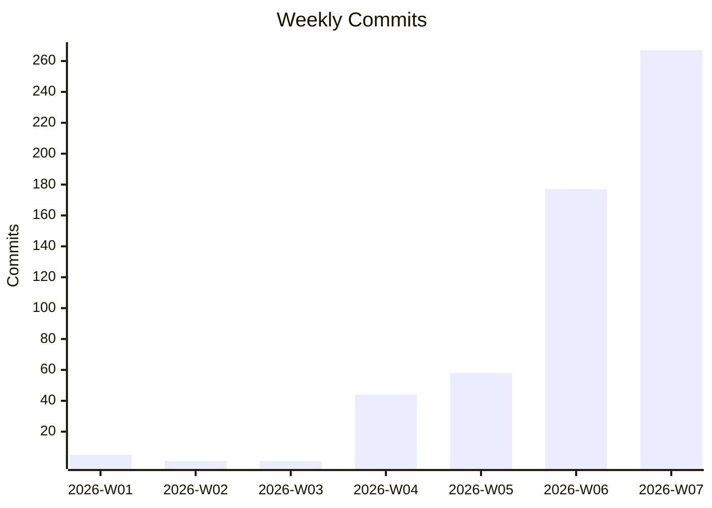
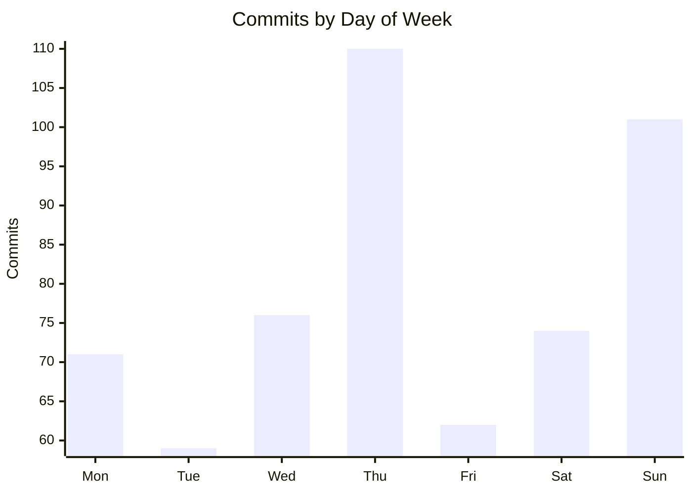
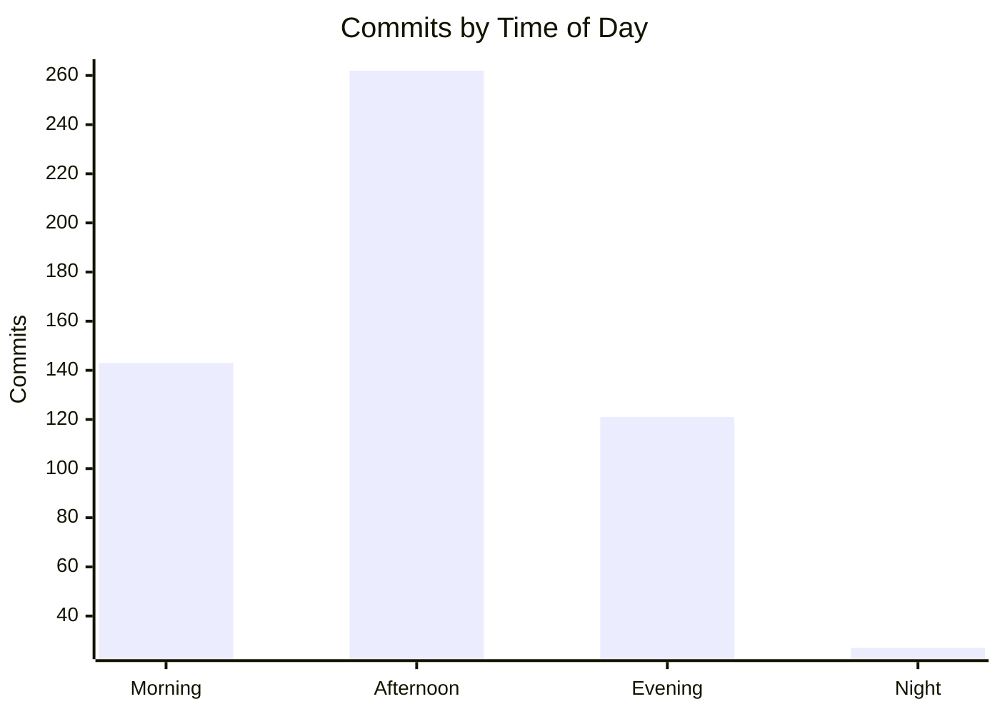
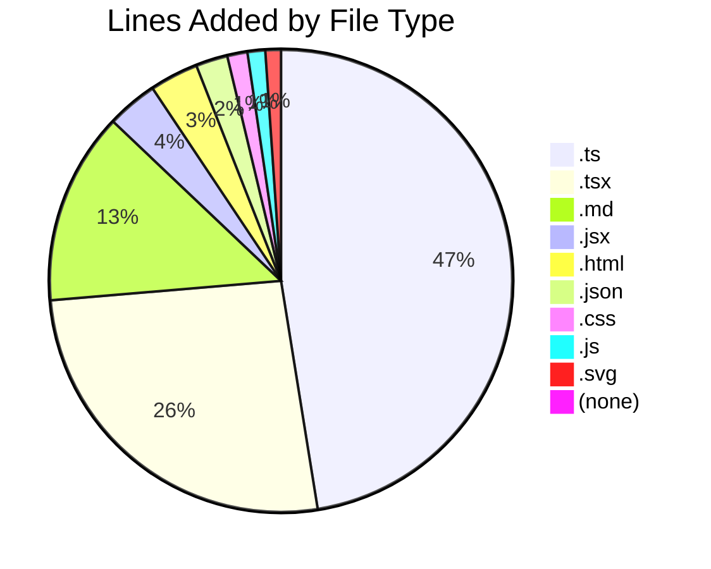

# Code Statistics Report

**Date Range:** 2026-01-01 to 2026-02-13  
**Generated:** 2026-02-13  
**Repositories Scanned:** 20 (12 active, 8 inactive)

## Executive Summary

**whiskey-canon** leads activity with 142 commits. Across 12 active repositories, there were **553 commits** adding **138,423** and removing **57,464** lines of code, with **291 merged PRs**. Test code accounts for 19.1% of lines added. 323 issues were created and 209 closed (65% close rate).

## Summary Table

| Metric | Value |
|--------|------:|
| Commits | 553 |
| Lines Added | 138,423 |
| Lines Removed | 57,464 |
| Net Lines | +80,959 |
| Merged PRs | 291 |
| Issues Created | 323 |
| Issues Closed | 209 |
| Active Repos | 12 |
| Avg Commits/Day | 12.9 |
| Avg Commits/Week | 90.0 |

## Test vs Application Code Breakdown

| Category | Lines Added | Lines Removed | % of Added |
|----------|----------:|-------------:|----------:|
| Application Code | 111,987 | 54,056 | 80.9% |
| Test Code | 26,436 | 3,408 | 19.1% |
| **Total** | **138,423** | **57,464** | **100.0%** |

## Weekly Velocity

| Week | Commits | PRs |
|------|--------:|----:|
| 2026-W01 | 5 | — |
| 2026-W02 | 1 | — |
| 2026-W03 | 1 | — |
| 2026-W04 | 44 | — |
| 2026-W05 | 58 | — |
| 2026-W06 | 177 | — |
| 2026-W07 | 267 | — |

## Activity Patterns

### Day of Week Distribution

| Day | Commits | % |
|-----|--------:|--:|
| Monday | 71 | 12.8% |
| Tuesday | 59 | 10.7% |
| Wednesday | 76 | 13.7% |
| Thursday | 110 | 19.9% |
| Friday | 62 | 11.2% |
| Saturday | 74 | 13.4% |
| Sunday | 101 | 18.3% |

### Time of Day Distribution

| Time Bucket | Commits | % |
|-------------|--------:|--:|
| Morning (6-12) | 143 | 25.9% |
| Afternoon (12-18) | 262 | 47.4% |
| Evening (18-24) | 121 | 21.9% |
| Night (0-6) | 27 | 4.9% |

**Longest Commit Streak:** 10 consecutive days (whiskey-canon)

## Repository Breakdown

| Repository | Commits | App Lines +/- | Test Lines +/- | Net Change | Test % | Merged PRs | Issues Created | Issues Closed | Bus Factor |
|------------|--------:|--------------:|---------------:|-----------:|-------:|-----------:|---------------:|--------------:|-----------|
| whiskey-canon | 142 | +17,696 / -3,801 | +12,640 / -1,335 | +25,200 | 41.7% | 68 | 54 | 22 | 1 of 3 |
| clahub | 139 | +19,474 / -4,609 | +3,890 / -1,614 | +17,141 | 16.6% | 80 | 170 | 154 | 1 of 2 |
| fusion94 | 77 | +3,154 / -1,020 | +0 / -0 | +2,134 | 0.0% | 0 | 0 | 0 | 2 of 2 |
| whiskey-canon-blinds | 60 | +32,435 / -1,193 | +3,269 / -16 | +34,495 | 9.2% | 52 | 1 | 0 | 1 of 1 |
| sports-card-tracker | 54 | +5,855 / -1,781 | +6,637 / -171 | +10,540 | 53.1% | 7 | 32 | 7 | 1 of 1 |
| cellar-sync | 27 | +6,284 / -4,243 | +0 / -0 | +2,041 | 0.0% | 3 | 33 | 1 | 1 of 1 |
| rims | 24 | +12,586 / -33,219 | +0 / -272 | -20,905 | 0.0% | 79 | 24 | 22 | 1 of 1 |
| sh-underground | 14 | +5,519 / -535 | +0 / -0 | +4,984 | 0.0% | 0 | 0 | 0 | 1 of 1 |
| StringAlong | 9 | +1,063 / -36 | +0 / -0 | +1,027 | 0.0% | 0 | 0 | 0 | 1 of 2 |
| fusion94.org | 4 | +6,114 / -3,434 | +0 / -0 | +2,680 | 0.0% | 0 | 0 | 0 | 1 of 1 |
| damagelabs-www | 2 | +1,679 / -9 | +0 / -0 | +1,670 | 0.0% | 0 | 0 | 0 | 1 of 1 |
| collectorsplaybook | 1 | +128 / -176 | +0 / -0 | -48 | 0.0% | 0 | 0 | 0 | 1 of 1 |

## Code Quality Signals

### PR Size & Commit Ratios

| Repository | Avg PR Size (lines) | Commit-to-PR Ratio | Flag |
|------------|--------------------:|-------------------:|------|
| whiskey-canon | 667 | 2.1 | ⚠️ Large PRs |
| clahub | 634 | 1.7 | ⚠️ Large PRs |
| whiskey-canon-blinds | 898 | 1.2 | ⚠️ Large PRs |
| sports-card-tracker | 341402 | 7.7 | ⚠️ Large PRs |
| cellar-sync | 6336 | 9.0 | ⚠️ Large PRs |
| rims | 925 | 0.3 | ⚠️ Large PRs |

### High-Churn Files (Rework Indicators)

| Touches | Repository | File |
|--------:|------------|------|
| 39 | fusion94 | `profile/stats.svg` |
| 37 | fusion94 | `profile/streak.svg` |
| 19 | fusion94 | `README.md` |
| 19 | fusion94 | `.github/workflows/grs.yml` |
| 18 | whiskey-canon-blinds | `server/src/routes/auth.ts` |
| 15 | whiskey-canon-blinds | `src/services/api.ts` |
| 15 | whiskey-canon | `backend/package.json` |
| 12 | whiskey-canon-blinds | `server/src/index.ts` |
| 12 | whiskey-canon-blinds | `server/src/db/index.ts` |
| 12 | whiskey-canon | `backend/src/test/setup.ts` |
| 11 | clahub | `src/app/agreements/edit/[id]/page.tsx` |
| 11 | whiskey-canon-blinds | `server/src/db/schema.ts` |
| 11 | whiskey-canon-blinds | `package.json` |
| 11 | whiskey-canon-blinds | `CHANGELOG.md` |
| 10 | clahub | `README.md` |

## Collaboration Metrics

| Repository | Avg PR Turnaround | Avg Comments/PR | Unique Reviewers | Bus Factor |
|------------|------------------:|----------------:|-----------------:|-----------|
| clahub | 113 days | 0.8 | 0 | 1 of 2 |
| rims | 30 days | 0.0 | 0 | 1 of 1 |
| whiskey-canon | 35m | 0.7 | 2 | 1 of 3 |
| whiskey-canon-blinds | 0m | 0.0 | 0 | 1 of 1 |
| sports-card-tracker | 2.0h | 0.0 | 0 | 1 of 1 |
| cellar-sync | 1m | 0.0 | 0 | 1 of 1 |

## Issue Activity

| Repository | Created | Closed | Close Rate | Avg Resolution Time | Flag |
|------------|--------:|-------:|-----------:|--------------------:|------|
| clahub | 170 | 154 | 90.6% | 1573 days |  |
| whiskey-canon | 54 | 22 | 40.7% | 5.2 days | ⚠️ Low close rate |
| cellar-sync | 33 | 1 | 3.0% | 25m | ⚠️ Low close rate |
| sports-card-tracker | 32 | 7 | 21.9% | 17.5h | ⚠️ Low close rate |
| rims | 24 | 22 | 91.7% | 838 days |  |
| fitbit2garmin | 9 | 3 | 33.3% | 10 days | ⚠️ Low close rate |
| whiskey-canon-blinds | 1 | 0 | 0.0% | N/A | ⚠️ Low close rate |

## Repo Health Dashboard

| Repository | Last Commit | Open Issues | Open PRs | Branches | Flag |
|------------|-------------|------------:|---------:|---------:|------|
| whiskey-canon | 2026-02-13 | 32 | 1 | 60 | ⚠️ 60 branches, ⚠️ 32 open issues |
| clahub | 2026-02-12 | 16 | 0 | 3 | ⚠️ 16 open issues |
| fusion94 | 2026-02-10 | 0 | 0 | 1 |  |
| sh-underground | 2026-02-10 | 0 | 0 | 1 |  |
| cellar-sync | 2026-02-10 | 32 | 0 | 4 | ⚠️ 32 open issues |
| sports-card-tracker | 2026-02-09 | 25 | 0 | 7 | ⚠️ 7 branches, ⚠️ 25 open issues |
| rims | 2026-02-03 | 2 | 0 | 11 | ⚠️ 11 branches |
| whiskey-canon-blinds | 2026-02-01 | 1 | 0 | 5 |  |
| StringAlong | 2026-01-29 | 0 | 0 | 1 |  |
| damagelabs-www | 2026-01-20 | 0 | 0 | 1 |  |
| fusion94.org | 2026-01-15 | 0 | 0 | 1 |  |
| collectorsplaybook | 2026-01-06 | 0 | 0 | 2 |  |
| PRDs | 2025-12-30 | 0 | 0 | 1 |  |
| recipe-planner | 2025-08-18 | — | — | 0 |  |
| dory-clone | 2025-08-15 | — | — | 0 |  |
| gunken.io | 2025-07-31 | 0 | 0 | 1 |  |
| image-processing | 2025-06-18 | 0 | 0 | 1 |  |
| Go-FilamentSamples | 2025-06-17 | 1 | 0 | 3 |  |
| banderaskyworks | 2025-06-16 | 0 | 0 | 2 |  |
| fitbit2garmin | 2023-12-17 | 6 | 1 | 8 | ⚠️ 8 branches |

## File Type Distribution

| Extension | Lines Added | Lines Removed | % of Added |
|-----------|----------:|-------------:|----------:|
| `.ts` | 62,752 | 7,550 | 45.3% |
| `.tsx` | 34,633 | 2,833 | 25.0% |
| `.md` | 17,755 | 2,692 | 12.8% |
| `.jsx` | 4,696 | 376 | 3.4% |
| `.html` | 4,497 | 2,882 | 3.2% |
| `.json` | 2,940 | 1,331 | 2.1% |
| `.css` | 1,866 | 11,276 | 1.3% |
| `.js` | 1,637 | 17,584 | 1.2% |
| `.svg` | 1,436 | 3,163 | 1.0% |
| `(none)` | 1,086 | 237 | 0.8% |
| `.xml` | 952 | 768 | 0.7% |
| `.yaml` | 911 | 1 | 0.7% |
| `.sh` | 906 | 52 | 0.7% |
| `.yml` | 561 | 573 | 0.4% |
| `.cjs` | 385 | 33 | 0.3% |
| `.sql` | 314 | 126 | 0.2% |
| `.gitignore` | 297 | 93 | 0.2% |
| `.conf` | 245 | 0 | 0.2% |
| `.prisma` | 166 | 12 | 0.1% |
| `.example` | 165 | 29 | 0.1% |

## Inactive Repositories

| Repository | GitHub Org/Owner | Last Commit Date |
|------------|-----------------|-----------------|
| PRDs | DamageLabs | 2025-12-30 |
| recipe-planner | — | 2025-08-18 |
| dory-clone | — | 2025-08-15 |
| gunken.io | fusion94 | 2025-07-31 |
| image-processing | Collectors-Playbook | 2025-06-18 |
| Go-FilamentSamples | fusion94 | 2025-06-17 |
| banderaskyworks | Bandera-Skyworks | 2025-06-16 |
| fitbit2garmin | simonepri | 2023-12-17 |

## Top Contributors

### By Commits

| Rank | Contributor | Commits |
|-----:|------------|--------:|
| 1 | Tony Guntharp | 494 |
| 2 | fusion94 | 41 |
| 3 | dependabot[bot] | 16 |
| 4 | copilot-swe-agent[bot] | 2 |

### By Lines Added

| Rank | Contributor | Lines Added |
|-----:|------------|----------:|
| 1 | Tony Guntharp | 132,864 |
| 2 | dependabot[bot] | 3,372 |
| 3 | fusion94 | 1,756 |
| 4 | copilot-swe-agent[bot] | 427 |

## Changes Since Last Report

Comparing to previous report (2026-02-10):

| Metric | Previous | Current | Change |
|--------|--------:|--------:|-------:|
| Commits | 378 | 553 | +175 (+46.3%) |
| Lines Added | 111,801 | 138,423 | +26,622 (+23.8%) |
| Lines Removed | 50,532 | 57,464 | +6,932 (+13.7%) |
| Merged PRs | 123 | 291 | +168 (+136.6%) |
| Issues Created | 141 | 323 | +182 (+129.1%) |
| Issues Closed | 47 | 209 | +162 (+344.7%) |

### Per-Repository Changes

| Repository | Commits Δ | Lines Added Δ | PRs Δ |
|------------|----------:|--------------:|------:|
| whiskey-canon | +35 | +1,873 | +26 |
| clahub | +139 | +23,364 | +80 |
| fusion94 | +1 | +492 | +0 |
| whiskey-canon-blinds | +0 | +320 | +0 |
| sports-card-tracker | +0 | +301 | +0 |
| rims | +0 | +179 | +60 |
| fusion94.org | +0 | +93 | +0 |

## Notes

### Methodology
- Merge commits are excluded from all commit counts
- Generated and vendored files are excluded (lock files, `node_modules/`, `vendor/`, `dist/`, `build/`, minified files)
- Binary files are excluded from line counts
- Test code is identified by directory (`test/`, `tests/`, `__tests__/`, `spec/`) and file naming conventions (`*.test.*`, `*.spec.*`, `*_test.*`)
- Bus factor = number of authors covering 80% of commits
- High-churn files = files modified in 3+ commits during the period

### GitHub Data Unavailable
The following repos had no GitHub data: dory-clone, recipe-planner

*Report generated on 2026-02-13 covering 2026-01-01 to 2026-02-13 (43 days)*