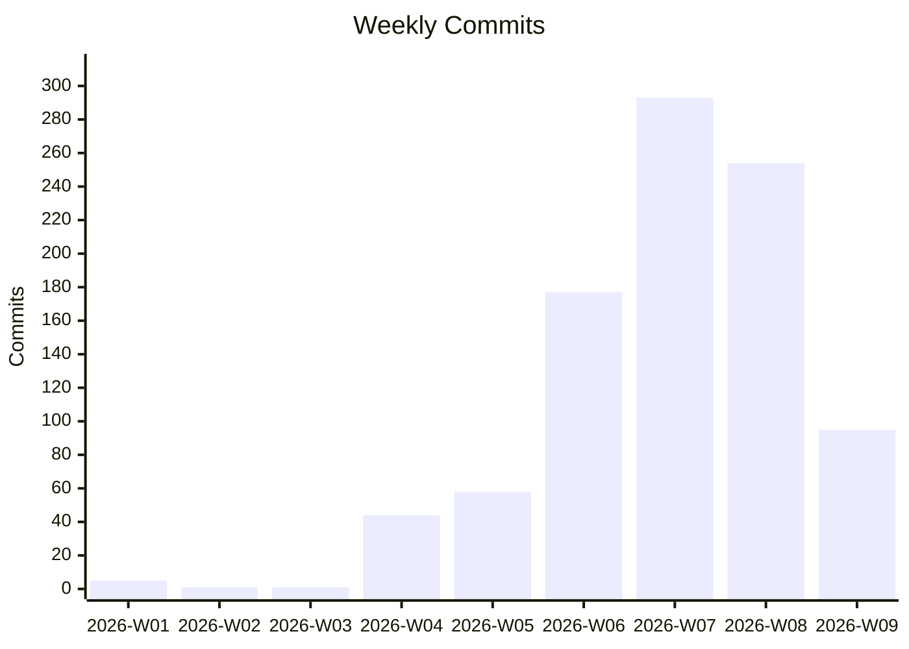
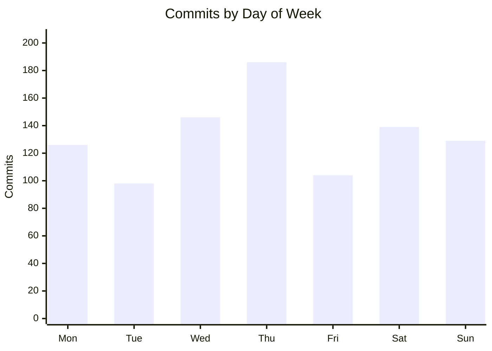
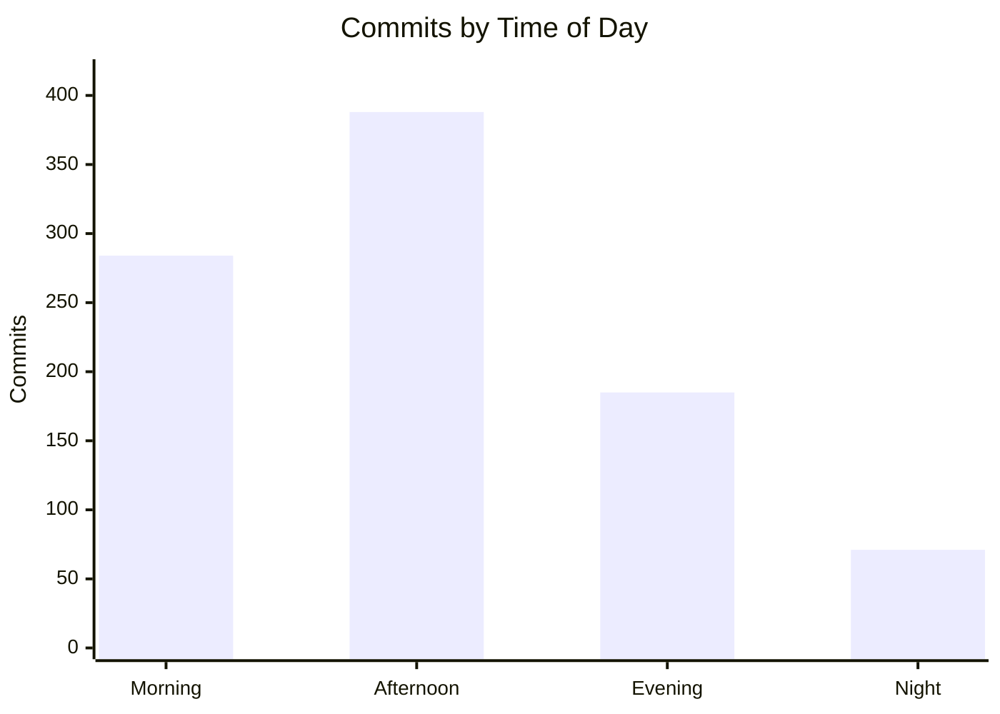
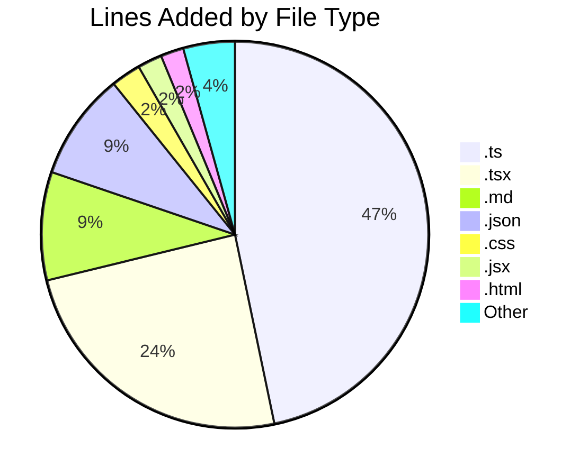

# Code Statistics Report
**Date Range:** 2026-01-01 to 2026-02-25  
**Generated:** 2026-02-25  
**Repositories Scanned:** 19 (13 active, 6 inactive)

## 1. Executive Summary

Over the first 8 weeks of 2026, **928 commits** were made across **13 active repositories**, adding **229,402 lines** and removing **74,805 lines** (154,597 net). **whiskey-canon** led in commit activity (202 commits) while **berlin-reunion** saw the most code addition (46,939 lines). Development velocity accelerated significantly in weeks 7-9, with **285 PRs merged** and **464 issues created** (303 closed). Test code accounted for **20.4%** of all lines added, with whiskey-canon and sports-card-tracker leading in test coverage.

## 2. Summary Table

| Metric | Value |
|--------|------:|
| Total Commits | 928 |
| Lines Added | 229,402 |
| Lines Removed | 74,805 |
| Net Lines | 154,597 |
| Merged PRs | 285 |
| Issues Created | 464 |
| Issues Closed | 303 |
| Active Repos | 13 |
| Avg Commits/Day | 16.6 |
| Avg Commits/Week | 116.0 |

## 3. Test vs Application Code Breakdown

| Category | Lines Added | % Added | Lines Removed | % Removed |
|----------|------------|---------|---------------|-----------|
| Application Code | 182,623 | 79.6% | 69,476 | 92.9% |
| Test Code | 46,779 | 20.4% | 5,329 | 7.1% |
| **Total** | **229,402** | **100%** | **74,805** | **100%** |

## 4. Weekly Velocity

| Week | Commits | PRs Merged |
|------|--------:|-----------:|
| 2026-W01 | 5 | 0 |
| 2026-W02 | 1 | 0 |
| 2026-W03 | 1 | 0 |
| 2026-W04 | 44 | 30 |
| 2026-W05 | 58 | 39 |
| 2026-W06 | 177 | 42 |
| 2026-W07 | 293 | 71 |
| 2026-W08 | 254 | 68 |
| 2026-W09 | 95 | 35 |
| **Total** | **928** | **285** |

## 5. Activity Patterns

### Day of Week Distribution

| Day | Commits | % |
|-----|--------:|--:|
| Monday | 126 | 13.6% |
| Tuesday | 98 | 10.6% |
| Wednesday | 146 | 15.7% |
| Thursday | 186 | 20.0% |
| Friday | 104 | 11.2% |
| Saturday | 139 | 15.0% |
| Sunday | 129 | 13.9% |

### Time of Day Distribution

| Period | Hours | Commits | % |
|--------|-------|--------:|--:|
| Morning | 6am-12pm | 284 | 30.6% |
| Afternoon | 12pm-6pm | 388 | 41.8% |
| Evening | 6pm-12am | 185 | 19.9% |
| Night | 12am-6am | 71 | 7.7% |

### Commit Streak

**Longest streak of consecutive days with commits:** 22 days (Jan 24 - Feb 14)

## 6. Repository Breakdown

| Repository | Commits | App Lines +/- | Test Lines +/- | Net Change | Test % | Merged PRs | Issues Created | Issues Closed | Bus Factor |
|------------|--------:|---------------|----------------|----------:|-------:|-----------:|---------------:|--------------:|------------|
| whiskey-canon | 202 | +26,360/-10,157 | +16,387/-1,500 | 31,090 | 38.3% | 79 | 57 | 29 | 1 of 4 |
| berlin-reunion | 198 | +40,495/-4,523 | +6,444/-580 | 41,836 | 13.7% | 59 | 109 | 61 | 1 of 1 |
| sports-card-tracker | 171 | +27,924/-6,449 | +16,789/-1,298 | 36,966 | 37.5% | 43 | 61 | 33 | 1 of 1 |
| clahub | 139 | +19,474/-4,609 | +3,890/-1,614 | 17,141 | 16.6% | 30 | 170 | 154 | 1 of 2 |
| fusion94 | 77 | +3,154/-1,020 | +0/-0 | 2,134 | 0.0% | 0 | 0 | 0 | 2 of 2 |
| whiskey-canon-blinds | 60 | +32,115/-1,172 | +3,269/-16 | 34,196 | 9.2% | 52 | 1 | 0 | 1 of 1 |
| cellar-sync | 27 | +6,284/-4,243 | +0/-0 | 2,041 | 0.0% | 3 | 33 | 1 | 1 of 1 |
| rims | 24 | +12,407/-33,159 | +0/-321 | -21,073 | 0.0% | 19 | 24 | 22 | 1 of 1 |
| sh-underground | 14 | +5,519/-535 | +0/-0 | 4,984 | 0.0% | 0 | 0 | 0 | 1 of 1 |
| StringAlong | 9 | +1,063/-36 | +0/-0 | 1,027 | 0.0% | 0 | 0 | 0 | 1 of 2 |
| fusion94.org | 4 | +6,021/-3,388 | +0/-0 | 2,633 | 0.0% | 0 | 0 | 0 | 1 of 1 |
| damagelabs-www | 2 | +1,679/-9 | +0/-0 | 1,670 | 0.0% | 0 | 0 | 0 | 1 of 1 |
| collectorsplaybook | 1 | +128/-176 | +0/-0 | -48 | 0.0% | 0 | 0 | 0 | 1 of 1 |

## 7. Code Quality Signals

### PR Size & Commit-to-PR Ratio

| Repository | Avg PR Size (lines) | Commit-to-PR Ratio | Flag |
|------------|--------------------:|-------------------:|------|
| whiskey-canon | 669 | 2.6 |  :warning: |
| berlin-reunion | 1,382 | 3.4 |  :warning: |
| whiskey-canon-blinds | 898 | 1.2 |  :warning: |
| sports-card-tracker | 56,527 | 4.0 |  :warning: |
| clahub | 1,595 | 4.6 |  :warning: |
| rims | 3,566 | 1.3 |  :warning: |
| cellar-sync | 6,336 | 9.0 |  :warning: |

> :warning: = Average PR size exceeds 500 lines. Note: GitHub PR sizes include lock files and generated code not filtered in our line counts.
> sports-card-tracker's high avg PR size (56,527) is inflated by GitHub's inclusion of unfiltered lock/generated files in PR diffs.

### Top High-Churn Files (Rework Indicator)

Files modified in 3+ commits with both additions and deletions, ranked by commit frequency:

| Repo | File | Commits | Lines Changed |
|------|------|--------:|--------------:|
| berlin-reunion | `src/app/admin/page.tsx` | 25 | 3,766 |
| sports-card-tracker | `server/src/types.ts` | 20 | 485 |
| whiskey-canon | `backend/package.json` | 20 | 52 |
| whiskey-canon-blinds | `server/src/routes/auth.ts` | 18 | 1,926 |
| berlin-reunion | `src/db/schema.ts` | 18 | 446 |
| whiskey-canon | `frontend/src/services/api.ts` | 16 | 1,964 |
| berlin-reunion | `docs/implementation.md` | 16 | 449 |
| sports-card-tracker | `server/src/database.ts` | 15 | 2,444 |
| sports-card-tracker | `server/src/index.ts` | 15 | 276 |
| whiskey-canon-blinds | `src/services/api.ts` | 15 | 1,509 |

## 8. Collaboration Metrics

| Repository | Avg PR Turnaround | Avg Comments/PR | Unique Reviewers | Bus Factor |
|------------|------------------:|----------------:|-----------------:|------------|
| whiskey-canon | 39m | 0.0 | 0 | 1 of 4 |
| berlin-reunion | 8m | 0.0 | 0 | 1 of 1 |
| whiskey-canon-blinds | 0m | 0.0 | 0 | 1 of 1 |
| sports-card-tracker | 31m | 0.0 | 0 | 1 of 1 |
| clahub | 21m | 0.0 | 0 | 1 of 2 |
| rims | 3m | 0.0 | 0 | 1 of 1 |
| cellar-sync | 1m | 0.0 | 0 | 1 of 1 |

> All repos show 0 PR reviewers and 0 comments, indicating a solo development workflow with self-merged PRs.

## 9. Issue Activity

| Repository | Issues Created | Issues Closed | Close Rate | Avg Resolution Time | Flag |
|------------|---------------:|--------------:|-----------:|--------------------:|------|
| clahub | 170 | 154 | 90.6% | 4.3 years |  |
| berlin-reunion | 109 | 61 | 56.0% | 13h 48m |  |
| sports-card-tracker | 61 | 33 | 54.1% | 3.0 days |  |
| whiskey-canon | 57 | 29 | 50.9% | 4.9 days |  |
| cellar-sync | 33 | 1 | 3.0% | 25m |  :warning: |
| rims | 24 | 22 | 91.7% | 2.3 years |  |
| fitbit2garmin | 9 | 3 | 33.3% | 10.3 days |  :warning: |
| whiskey-canon-blinds | 1 | 0 | 0.0% | N/A |  :warning: |

> :warning: = Close rate below 50%, potentially falling behind on issue triage.
> clahub and rims show high avg resolution times because old issues (created years ago) were closed during this period.

## 10. Repo Health Dashboard

| Repository | Last Commit | Open Issues | Open PRs | Branches | Flag |
|------------|-------------|------------:|---------:|---------:|------|
| whiskey-canon | 2026-02-17 | 28 | 3 | 7 |  :warning: stale branches, 28 open issues |
| berlin-reunion | 2026-02-25 | 48 | 0 | 1 |  :warning: 48 open issues |
| sports-card-tracker | 2026-02-25 | 28 | 1 | 4 |  :warning: 28 open issues |
| clahub | 2026-02-12 | 16 | 2 | 3 |  :warning: 16 open issues |
| fusion94 | 2026-02-10 | 0 | 0 | 1 |  |
| whiskey-canon-blinds | 2026-02-01 | 1 | 0 | 5 |  |
| cellar-sync | 2026-02-10 | 32 | 0 | 4 |  :warning: 32 open issues |
| rims | 2026-02-03 | 2 | 0 | 11 |  :warning: stale branches |
| sh-underground | 2026-02-10 | 0 | 0 | 1 |  |
| StringAlong | 2026-01-29 | 0 | 0 | 1 |  |
| fusion94.org | 2026-01-15 | 0 | 0 | 1 |  |
| damagelabs-www | 2026-01-20 | 0 | 0 | 1 |  |
| collectorsplaybook | 2026-01-06 | 0 | 0 | 2 |  |
| Go-FilamentSamples (inactive) | 2025-06-17 | 1 | 0 | 3 |  |
| PRDs (inactive) | 2025-12-30 | 0 | 0 | 1 |  |
| banderaskyworks (inactive) | 2025-06-16 | 0 | 0 | 2 |  |
| fitbit2garmin (inactive) | 2023-12-17 | 6 | 1 | 8 |  :warning: stale branches |
| gunken.io (inactive) | 2025-07-31 | 0 | 0 | 1 |  |
| image-processing (inactive) | 2025-06-18 | 0 | 0 | 1 |  |

## 11. File Type Distribution

| Extension | Lines Added | % of Total |
|-----------|------------|------------|
| .ts | 107,213 | 46.7% |
| .tsx | 56,094 | 24.5% |
| .md | 20,761 | 9.1% |
| .json | 20,621 | 9.0% |
| .css | 5,722 | 2.5% |
| .jsx | 4,696 | 2.0% |
| .html | 4,404 | 1.9% |
| .js | 1,637 | 0.7% |
| .svg | 1,470 | 0.6% |
| (none) | 1,113 | 0.5% |
| .xml | 952 | 0.4% |
| .yaml | 911 | 0.4% |
| .sh | 906 | 0.4% |
| .sql | 722 | 0.3% |
| .yml | 561 | 0.2% |
| Other | 1,619 | 0.7% |

## 12. Inactive Repositories

Repositories with zero commits in the date range:

| Repository | GitHub Org/Owner | Last Commit Date |
|------------|-----------------|-----------------|
| Go-FilamentSamples | fusion94 | 2025-06-17 |
| PRDs | DamageLabs | 2025-12-30 |
| banderaskyworks | Bandera-Skyworks | 2025-06-16 |
| fitbit2garmin | simonepri | 2023-12-17 |
| gunken.io | fusion94 | 2025-07-31 |
| image-processing | Collectors-Playbook | 2025-06-18 |

## 13. Top Contributors

### By Commits

| Contributor | Commits | % of Total |
|-------------|--------:|------------|
| Tony Guntharp | 862 | 92.9% |
| fusion94 | 41 | 4.4% |
| dependabot[bot] | 18 | 1.9% |
| root | 5 | 0.5% |
| copilot-swe-agent[bot] | 2 | 0.2% |

### By Lines Added

| Contributor | Lines Added |
|-------------|------------|
| Tony Guntharp | 222,396 |
| dependabot[bot] | 3,765 |
| fusion94 | 1,756 |
| root | 1,058 |
| copilot-swe-agent[bot] | 423 |

### By Merged PRs

All merged PRs were authored by Tony Guntharp (solo development workflow with automated bot contributions for dependency updates).

## 14. Changes Since Last Report

Compared to previous report (`code-stats-2026-02-13.json`, covering 2026-01-01 to 2026-02-13):

| Metric | Previous | Current | Change |
|--------|----------|---------|--------|
| Commits | 553 | 928 | +375 (+67.8%) |
| Lines Added | 138,423 | 229,402 | +90,979 (+65.7%) |
| Lines Removed | 57,464 | 74,805 | +17,341 (+30.2%) |
| Merged PRs | 291 | 285 | -6 (-2.1%) |
| Issues Created | 323 | 464 | +141 (+43.7%) |
| Issues Closed | 209 | 303 | +94 (+45.0%) |

**Key changes:**
- **+375 commits** (+67.8%) in 12 additional days, driven by berlin-reunion (198 new commits) and accelerated sports-card-tracker activity
- **berlin-reunion** is a newly tracked repository since the last report, contributing 59 merged PRs and 109 issues
- **sports-card-tracker** saw major acceleration (+117 commits, +36 PRs)
- Merged PRs total appears slightly lower due to variance in GitHub API query results for clahub and rims (see Notes)

## 15. Notes

### Methodology
- Merge commits are excluded from all commit counts
- Binary files are excluded from line counts
- Generated/vendored files excluded: lock files (`package-lock.json`, `yarn.lock`, etc.), `vendor/`, `node_modules/`, `dist/`, `build/`, `__pycache__/`, `*.min.js`, `*.min.css`, `*.bundle.js`, `*.generated.*`
- Test files classified by directory (`test/`, `tests/`, `__tests__/`, `spec/`) and file naming conventions (`*.test.ts`, `*_test.go`, `test_*.py`, etc.)
- PR sizes reported by GitHub may include lock files and generated code not filtered in our git numstat analysis
- High avg issue resolution times in clahub and rims reflect old issues (created years before 2026) being closed during this period

### Caveats
- All repositories have GitHub data available
- fusion94.org `_site/` directory churn is from Jekyll build artifacts committed to the repo
- The `fusion94` profile repo includes automated SVG updates from GitHub Actions (profile stats, streak badges)
- sports-card-tracker GitHub PR size metric (56,527 avg) is inflated by unfiltered generated/lock file diffs in GitHub's API

*Generated on 2026-02-25 by code-stats*