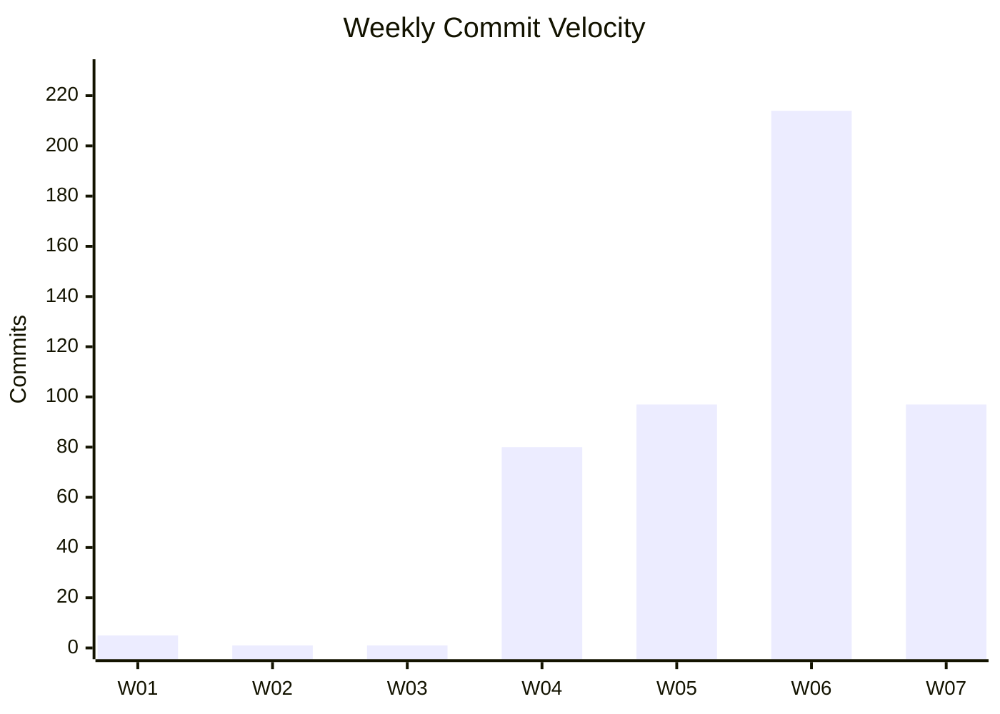
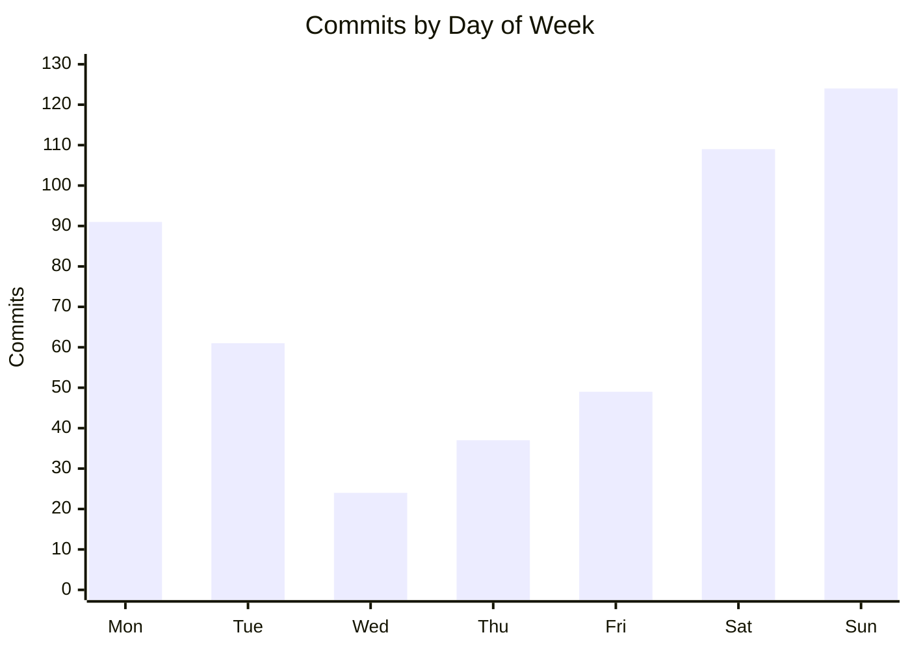
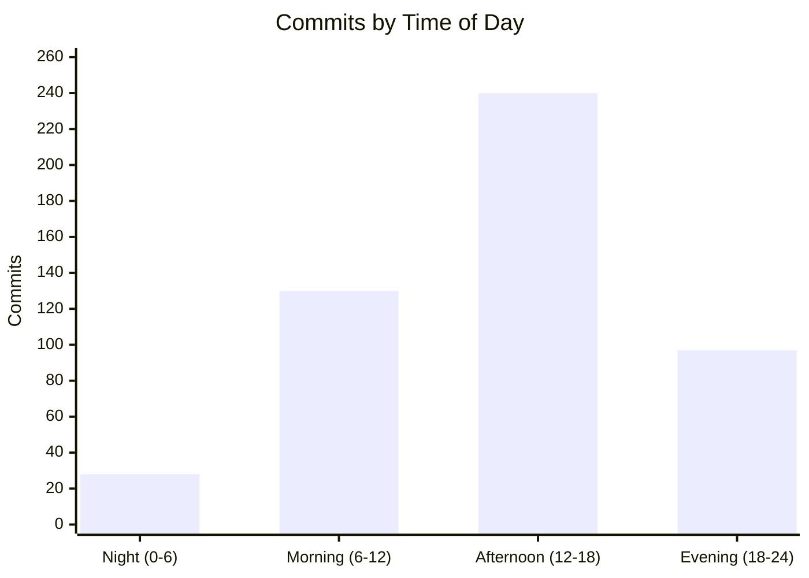
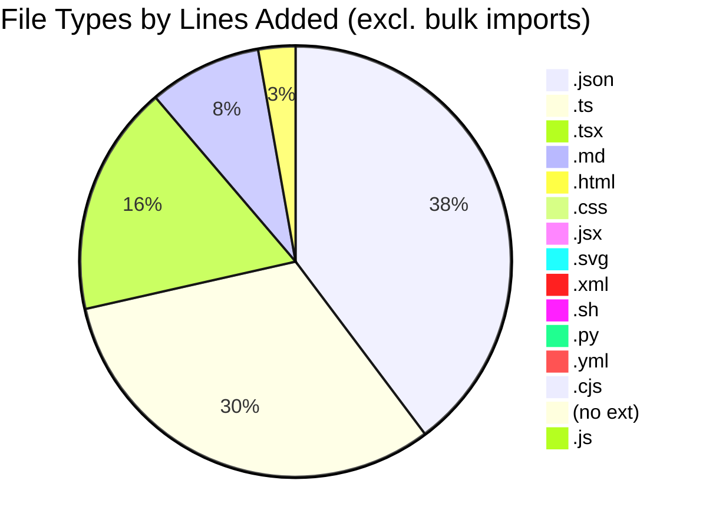

# Code Statistics Report

**Period:** January 1, 2026 - February 10, 2026
**Generated:** 2026-02-10
**Repositories Scanned:** 23

---

## Executive Summary

Development activity continues to accelerate with **495 total commits** across **13 active repositories** — up 15.7% from 428 commits in the previous report (Feb 9). Two new projects emerged: **cellar-sync** (30 commits, 3 merged PRs, a new whiskey cellar management app) and **sh-underground** (14 commits, a fork/migration of the underground repo with 1.5M+ lines churned). **whiskey-canon** remains the dominant project at 148 commits and 42 merged PRs with strong 36.8% test code investment, while **fusion94** surged from 58 to 71 commits. The **18-day commit streak** (Jan 24 – Feb 10, ongoing) and a shift toward more weekday activity (52.9% vs previous 45.3%) suggest increasing project momentum.

---

## Summary

| Metric | Total |
|--------|-------|
| **Active Repositories** | 13 |
| **Inactive Repositories** | 10 |
| **Total Commits** | 495 |
| **Total Lines Added** | 3,270,569 |
| **Total Lines Removed** | 4,139,315 |
| **Net Lines Changed** | -868,746 |
| **Total Merged PRs** | 123 |
| **Avg Commits/Day** | 12.1 |
| **Avg Commits/Week** | 84.5 |

> **Note:** The net negative line count is primarily from **sports-card-tracker** (2.37M lines removed in vendored dependency cleanup) and **sh-underground** (1.5M lines removed in repo migration). Both **underground** and **sh-underground** contain 1.5M+ lines of bulk-imported code.

---

## Test vs Application Code Breakdown

| Category | Lines Added | % Added | Lines Removed | % Removed | Net Change |
|----------|-------------|---------|---------------|-----------|------------|
| **Application Code** | 3,238,636 | 99.0% | 4,090,744 | 98.8% | -852,108 |
| **Test Code** | 31,933 | 1.0% | 48,571 | 1.2% | -16,638 |
| **Total** | 3,270,569 | 100% | 4,139,315 | 100% | -868,746 |

> **Excluding bulk import/migration repos** (`underground` 1.5M+ added, `sh-underground` 1.5M+ churned, `sports-card-tracker` 2.3M removed), the adjusted breakdown is:

| Category | Lines Added | % Added | Lines Removed | % Removed | Net Change |
|----------|-------------|---------|---------------|-----------|------------|
| **Application Code** | 133,412 | 89.6% | 71,543 | 97.9% | +61,869 |
| **Test Code** | 15,490 | 10.4% | 1,531 | 2.1% | +13,959 |
| **Total** | 148,902 | 100% | 73,074 | 100% | +75,828 |

---

## Weekly Velocity

| Week | Dates | Commits | Merged PRs |
|------|-------|---------|------------|
| W01 | Dec 29 – Jan 4 | 5 | — |
| W02 | Jan 5 – Jan 11 | 1 | — |
| W03 | Jan 12 – Jan 18 | 1 | — |
| W04 | Jan 19 – Jan 25 | 80 | — |
| W05 | Jan 26 – Feb 1 | 97 | — |
| W06 | Feb 2 – Feb 8 | 214 | — |
| W07 | Feb 9 – Feb 10 (partial) | 97 | — |

> **Note:** PR merge counts are aggregated at the repo level (see Active Repositories table) rather than per-week due to GitHub API limitations on date-range filtering. W06 remains the most active week with 214 commits.

---

## Activity Patterns

### Day of Week

| Day | Commits | % of Total |
|-----|---------|------------|
| Sunday | 124 | 25.1% |
| Saturday | 109 | 22.0% |
| Monday | 91 | 18.4% |
| Tuesday | 61 | 12.3% |
| Friday | 49 | 9.9% |
| Thursday | 37 | 7.5% |
| Wednesday | 24 | 4.8% |

> Weekend activity (47.1%) is now more balanced with weekday activity (52.9%), compared to 54.7% weekend in the previous report — indicating increasing weekday development momentum.

### Time of Day

| Time Bucket | Commits | % of Total |
|-------------|---------|------------|
| Morning (6–12) | 130 | 26.3% |
| Afternoon (12–18) | 240 | 48.5% |
| Evening (18–24) | 97 | 19.6% |
| Night (0–6) | 28 | 5.7% |

### Commit Streak

| Metric | Value |
|--------|-------|
| **Longest Streak** | 18 consecutive days |
| **Streak Period** | Jan 24 – Feb 10 (ongoing) |

---

## Active Repositories (sorted by commits, descending)

| Repository | Commits | App Lines + | Test Lines + | Total + | Total - | Net Change | Merged PRs |
|------------|---------|-------------|--------------|---------|---------|------------|------------|
| whiskey-canon | 148 (29.9%) | 20,943 | 12,221 | 33,164 | 6,413 | +26,751 | 42 |
| whiskey-canon-blinds | 109 (22.0%) | 51,336 | 3,269 | 54,605 | 7,500 | +47,105 | 52 |
| fusion94 | 71 (14.3%) | 2,246 | 0 | 2,246 | 598 | +1,648 | 0 |
| sports-card-tracker | 61 (12.3%) | 12,542 | 6,637 | 19,179 | 2,372,213 | -2,353,034 | 7 |
| rims | 40 (8.1%) | 24,935 | 0 | 24,935 | 36,128 | -11,193 | 19 |
| cellar-sync | 30 (6.1%) | 21,296 | 0 | 21,296 | 17,646 | +3,650 | 3 |
| sh-underground | 14 (2.8%) | 1,548,131 | 4,903 | 1,553,034 | 1,543,979 | +9,055 | 0 |
| StringAlong | 9 (1.8%) | 380 | 0 | 380 | 1,170 | -790 | 0 |
| underground | 5 (1.0%) | 1,544,551 | 4,903 | 1,549,454 | 150,049 | +1,399,405 | 0 |
| fusion94.org | 4 (0.8%) | 6,114 | 0 | 6,114 | 3,434 | +2,680 | 0 |
| damagelabs-www | 2 (0.4%) | 5,358 | 0 | 5,358 | 9 | +5,349 | 0 |
| collectorsplaybook | 1 (0.2%) | 128 | 0 | 128 | 176 | -48 | 0 |
| claude-cards | 1 (0.2%) | 676 | 0 | 676 | 0 | +676 | 0 |

> **Note:** `underground` and `sh-underground` each show 1.5M+ lines, indicating bulk imports or generated files. `sports-card-tracker` shows 2.3M lines removed from vendored dependency cleanup. `sh-underground` appears to be a migration/fork of `underground` with ~1.5M lines added and removed.

---

## Test Coverage by Repository

| Repository | Test Lines Added | App Lines Added | Test % of Added | Notes |
|------------|------------------|-----------------|-----------------|-------|
| whiskey-canon | 12,221 | 20,943 | 36.8% | Strong test investment; Codecov integrated |
| sports-card-tracker | 6,637 | 12,542 | 34.6% | Good test coverage on new code |
| whiskey-canon-blinds | 3,269 | 51,336 | 6.0% | |
| sh-underground | 4,903 | 1,548,131 | 0.3% | Bulk migration skews ratio |
| underground | 4,903 | 1,544,551 | 0.3% | Bulk import skews ratio |
| cellar-sync | 0 | 21,296 | 0.0% | New project, early stage |
| rims | 0 | 24,935 | 0.0% | 321 test lines removed |
| StringAlong | 0 | 380 | 0.0% | |
| fusion94 | 0 | 2,246 | 0.0% | Profile/config repo |
| fusion94.org | 0 | 6,114 | 0.0% | Static site |
| damagelabs-www | 0 | 5,358 | 0.0% | |
| collectorsplaybook | 0 | 128 | 0.0% | |
| claude-cards | 0 | 676 | 0.0% | |

---

## Code Quality Signals

| Repository | Avg PR Size (lines) | Commit:PR Ratio | Flag |
|------------|---------------------|-----------------|------|
| sports-card-tracker | 341,402.0 | 8.7:1 | ⚠ Bulk cleanup PR skews avg |
| cellar-sync | 6,335.7 | 10.0:1 | ⚠ Large PRs, high commit:PR ratio |
| rims | 3,566.0 | 2.1:1 | ⚠ Large PRs |
| whiskey-canon | 915.3 | 3.5:1 | ⚠ Large PRs |
| whiskey-canon-blinds | 898.3 | 2.1:1 | ⚠ Large PRs |

> Repos with avg PR size > 500 lines may benefit from smaller, more focused pull requests. **sports-card-tracker** avg is heavily skewed by a bulk cleanup PR removing 2.38M lines. **cellar-sync** has a high commit:PR ratio (10:1) suggesting many commits are pushed directly without PRs.

### File Types by Repository (top extensions by lines added)

| Repository | Primary Types |
|------------|--------------|
| whiskey-canon | .ts (16,524), .tsx (8,061), .json (4,746), .md (1,520) |
| whiskey-canon-blinds | .json (19,145), .ts (18,716), .tsx (10,795), .md (5,562) |
| cellar-sync | .json (16,222), .md (2,713), .ts (1,620), .tsx (73) |
| rims | .json (12,495), .tsx (7,767), .ts (3,517) |
| sports-card-tracker | .ts (9,983), .json (6,740), .md (1,142), .tsx (769) |
| fusion94 | .svg (1,349), .md (730), .yml (135) |
| fusion94.org | .html (4,254), .xml (952), .md (872) |
| damagelabs-www | .json (3,724), .jsx (1,299), .js (184) |
| claude-cards | .py (442), .md (191), .csv (27) |

---

## Collaboration Metrics

| Repository | Avg PR Turnaround | Avg Comments/PR | Unique Reviewers | Bus Factor |
|------------|-------------------|-----------------|------------------|------------|
| whiskey-canon | 46m | 0.6 | 2 | 2 |
| sports-card-tracker | 2h 0m | 0.0 | 0 | 1 |
| rims | 3m 49s | 0.0 | 0 | 1 |
| cellar-sync | 1m 27s | 0.0 | 0 | 1 |
| whiskey-canon-blinds | < 1m | 0.0 | 0 | 1 |
| fusion94 | — | — | — | 2 |
| StringAlong | — | — | — | 2 |
| sh-underground | — | — | — | 1 |
| underground | — | — | — | 1 |
| fusion94.org | — | — | — | 1 |
| damagelabs-www | — | — | — | 1 |
| collectorsplaybook | — | — | — | 1 |
| claude-cards | — | — | — | 1 |

> **whiskey-canon** remains the only repo with meaningful PR review activity (2 unique reviewers including Copilot, 0.6 avg comments from Codecov). Most repos have a bus factor of 1, indicating single-contributor projects.

---

## Repo Health Dashboard

| Repository | Last Commit | Open Issues | Open PRs | Branches | Flags |
|------------|-------------|-------------|----------|----------|-------|
| whiskey-canon | Feb 10, 2026 | 34 | 0 | 39 | ⚠ 34 issues, 39 branches |
| sh-underground | Feb 10, 2026 | 0 | 0 | 2 | |
| fusion94 | Feb 10, 2026 | 0 | 0 | 2 | |
| cellar-sync | Feb 10, 2026 | 32 | 0 | 5 | ⚠ 32 issues |
| sports-card-tracker | Feb 9, 2026 | 25 | 0 | 8 | ⚠ 25 issues |
| rims | Feb 3, 2026 | 2 | 0 | 12 | ⚠ 12 branches |
| whiskey-canon-blinds | Feb 1, 2026 | 1 | 0 | 6 | |
| StringAlong | Jan 29, 2026 | 0 | 0 | 2 | |
| underground | Jan 28, 2026 | 0 | 0 | 2 | |
| damagelabs-www | Jan 20, 2026 | 0 | 0 | 2 | |
| claude-cards | Jan 20, 2026 | 0 | 0 | 2 | |
| fusion94.org | Jan 15, 2026 | 0 | 0 | 2 | |
| collectorsplaybook | Jan 6, 2026 | 0 | 0 | 3 | |
| PRDs | Dec 30, 2025 | 0 | 0 | 2 | |
| Cards/sports-card-tracker | Aug 5, 2025 | 25 | 0 | 2 | |
| dory/dory-clone | Aug 15, 2025 | — | — | 0 | No remote |
| recipe-planner/recipe-planner | Aug 18, 2025 | — | — | 0 | No remote |
| gunken.io | Jul 31, 2025 | 0 | 0 | 2 | |
| Go-FilamentSamples | Jun 17, 2025 | 1 | 0 | 4 | |
| image-processing | Jun 18, 2025 | 0 | 0 | 2 | |
| banderaskyworks | Jun 16, 2025 | 0 | 0 | 3 | |
| goalert | Apr 2, 2025 | 146 | 30 | 126 | ⚠ 146 issues, 30 open PRs, 126 branches |
| fitbit2garmin | Dec 17, 2023 | 6 | 1 | 9 | ⚠ 6 issues, stale (2+ years) |

> **cellar-sync** is a newly active project that already has 32 open issues representing planned features. **whiskey-canon** has 34 open issues and 39 remote branches — may need branch cleanup and issue triage. **goalert** (fork of target/goalert) issues/PRs/branches reflect upstream activity.

---

## File Type Distribution

| Extension | Lines Added | % of Total |
|-----------|-------------|------------|
| `.js` | 2,431,902 | 74.4% |
| `.ts` | 342,490 | 10.5% |
| `.md` | 247,831 | 7.6% |
| `.json` | 107,292 | 3.3% |
| `.tsx` | 53,483 | 1.6% |
| `.flow` | 24,846 | 0.8% |
| `.cjs` | 14,885 | 0.5% |
| `.mjs` | 12,420 | 0.4% |
| (no ext) | 10,832 | 0.3% |
| `.jsx` | 6,470 | 0.2% |
| `.html` | 4,559 | 0.1% |
| `.cts` | 1,924 | 0.1% |
| `.css` | 1,643 | 0.1% |
| `.mts` | 1,562 | <0.1% |
| `.svg` | 1,414 | <0.1% |
| Other | 5,016 | 0.2% |

> **Excluding `underground` and `sh-underground`** (which together add 2.4M `.js` lines from bulk imports), TypeScript (`.ts` + `.tsx`) dominates at 47.1% of remaining lines added.

---

## Inactive Repositories (no activity since Jan 1, 2026)

| Repository | GitHub Org/Owner | Last Commit |
|------------|------------------|-------------|
| PRDs | DamageLabs | Dec 30, 2025 |
| Cards/sports-card-tracker | Collectors-Playbook | Aug 5, 2025 |
| dory/dory-clone | (no GitHub remote) | Aug 15, 2025 |
| recipe-planner/recipe-planner | (no GitHub remote) | Aug 18, 2025 |
| gunken.io | fusion94 | Jul 31, 2025 |
| Go-FilamentSamples | fusion94 | Jun 17, 2025 |
| image-processing | Collectors-Playbook | Jun 18, 2025 |
| banderaskyworks | Bandera-Skyworks | Jun 16, 2025 |
| goalert | target (fork) | Apr 2, 2025 |
| fitbit2garmin | simonepri (fork) | Dec 17, 2023 |

---

## Top Contributors

### By Commits

| Rank | Contributor | Commits | % of Total |
|------|-------------|---------|------------|
| 1 | Tony Guntharp | 455 | 91.9% |
| 2 | fusion94 | 38 | 7.7% |
| 3 | copilot-swe-agent[bot] | 2 | 0.4% |

> **Note:** "Tony Guntharp" and "fusion94" are the same person with different git author configs (local vs GitHub-authored commits). Combined: 493 commits (99.6%).

### By Lines Added

| Rank | Contributor | Lines Added | % of Total |
|------|-------------|-------------|------------|
| 1 | Tony Guntharp | 3,269,175 | 99.96% |
| 2 | fusion94 | 1,387 | 0.04% |
| 3 | copilot-swe-agent[bot] | 7 | <0.01% |

### By Merged PRs

| Rank | Contributor | Merged PRs | % of Total |
|------|-------------|------------|------------|
| 1 | fusion94 | 122 | 99.2% |
| 2 | app/copilot-swe-agent | 1 | 0.8% |

---

## Most Active Projects

The top 3 projects by combined activity (commits + PRs):

1. **whiskey-canon** — 148 commits, 42 merged PRs, +26.7K net lines (36.8% test code). Codecov integration active with automated coverage comments on PRs.
2. **whiskey-canon-blinds** — 109 commits, 52 merged PRs, +47.1K net lines (6.0% test code)
3. **fusion94** — 71 commits, 0 PRs, +1.6K net lines (GitHub profile/config repository)

---

## Changes Since Last Report

Compared to the previous report (generated Feb 9, 2026):

| Metric | Previous | Current | Delta |
|--------|----------|---------|-------|
| Active Repositories | 11 | 13 | **+2** |
| Total Commits | 428 | 495 | **+67 (+15.7%)** |
| Total Lines Added | 1,686,566 | 3,270,569 | +1,584,003 |
| Total Lines Removed | 2,572,472 | 4,139,315 | +1,566,843 |
| Total Merged PRs | 119 | 123 | **+4 (+3.4%)** |
| Avg Commits/Day | 11.0 | 12.1 | +1.1 |
| Avg Commits/Week | 76.8 | 84.5 | +7.7 |
| Longest Streak | 17 days | 18 days | +1 day |

### Key Changes
- **+2 new active repos:** `cellar-sync` (30 commits, 3 PRs, 32 open issues — a new whiskey cellar management app) and `sh-underground` (14 commits, migration/fork of underground with 1.5M+ lines churned)
- **fusion94** surged from 58 to 71 commits (+13), continuing GitHub profile customization work
- **sports-card-tracker** went from 52 to 61 commits (+9) and 6 to 7 merged PRs (+1)
- **whiskey-canon** added 1 commit and 1 PR (148/42 vs 147/41)
- **W07 (Feb 9–10) is pacing at 97 commits in 2 days**, suggesting another high-activity week
- **Commit streak extended** from 17 to 18 consecutive days (Jan 24 – Feb 10, still ongoing)
- **Weekend vs weekday balance shifted** from 54.7% weekend to 47.1% weekend, indicating more weekday development
- **cellar-sync** launched as a new project with 32 open issues already tracked as a backlog

---

## Notes

- Statistics gathered from local git repositories in `/Users/guntharp/Code/`
- PR counts reflect merged pull requests on GitHub since 2026-01-01
- Line counts include all file types tracked by git
- Test files identified by directory (`test/`, `tests/`, `__tests__/`, `spec/`, `testing/`) and file naming conventions (`_test.go`, `.test.ts`, `.spec.js`, etc.)
- PR turnaround time measures creation-to-merge duration
- Bus factor = number of distinct commit authors per repo
- 2 repositories have no GitHub remote (dory/dory-clone, recipe-planner)
- `underground` bulk import (1.5M+ lines) and `sh-underground` migration (1.5M+ lines churned) significantly skew aggregate metrics; adjusted figures are provided where relevant
- `sports-card-tracker` bulk cleanup (2.37M lines removed) heavily skews removal metrics
- `goalert` is a fork of target/goalert — open issues/PRs/branches reflect upstream activity
- "Tony Guntharp" and "fusion94" represent the same contributor with different git author configurations
- Report generated on February 10, 2026
