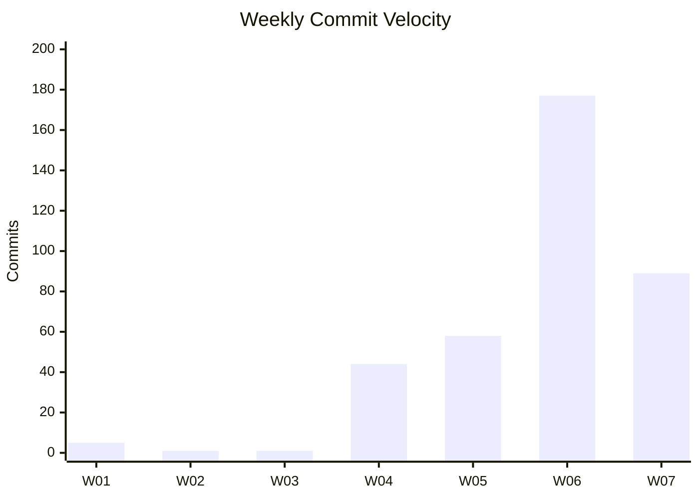
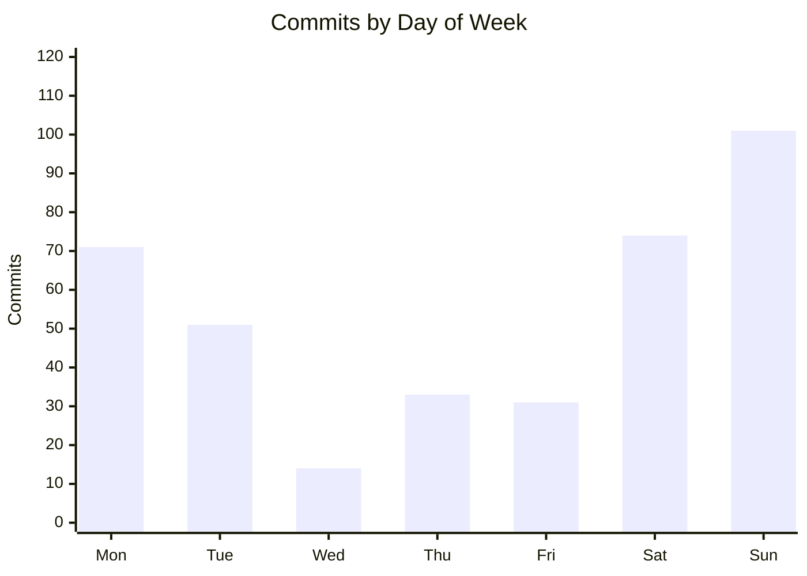
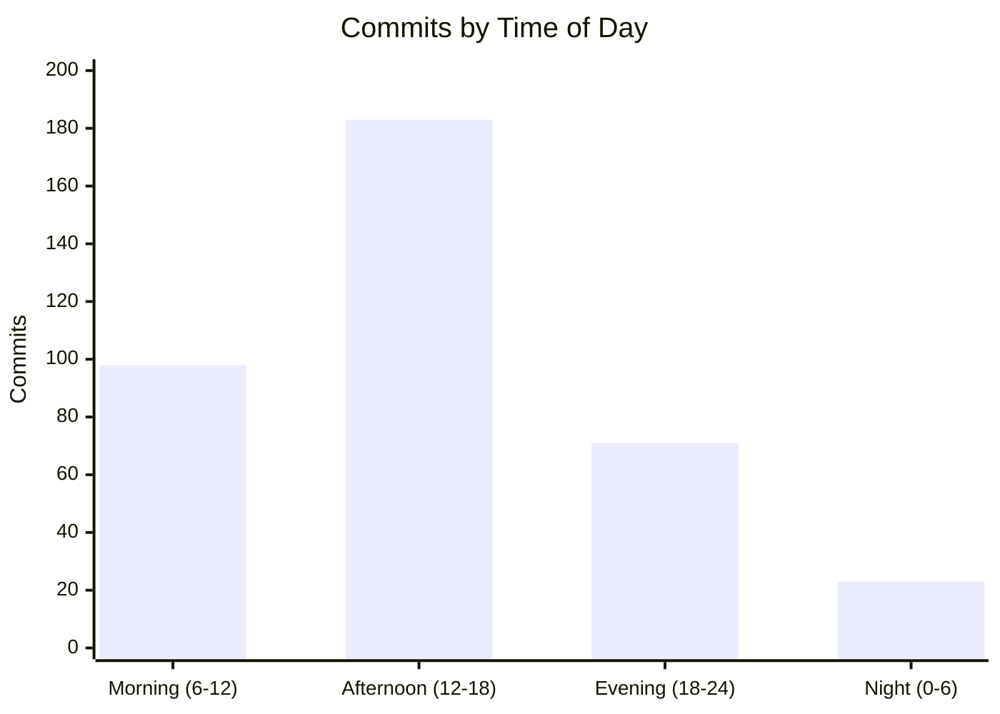
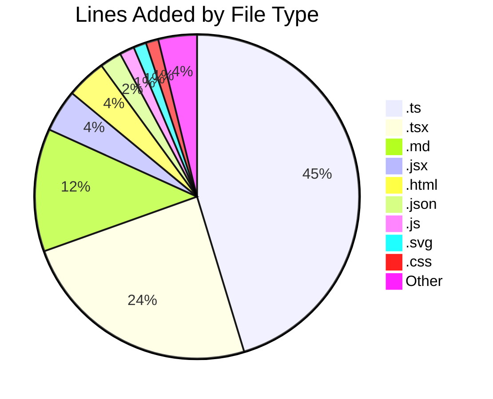

# Code Statistics Report

**Date Range:** 2026-01-01 to 2026-02-10 (41 days, ~5.86 weeks)
**Author Filter:** None (all authors)

---

## Executive Summary

Over the 41-day reporting period, **whiskey-canon** was the most active repository by commits (107), while **whiskey-canon-blinds** led in merged PRs (52) and lines added (35,384). Activity was heavily concentrated in weeks 4 through 7, with a strong 18-day consecutive commit streak from January 24 to February 10. The **rims** repository underwent a major refactoring effort, removing 33,480 lines of code during the period.

---

## Summary Table

| Metric | Value |
|--------|-------|
| Total Commits | 375 |
| Total Lines Added | 111,540 |
| Total Lines Removed | 49,897 |
| Net Lines | +61,643 |
| Total Merged PRs | 123 |
| Issues Created (all repos) | 270 |
| Issues Closed (all repos) | 170 |

---

## Test vs Application Code Breakdown

| Category | Lines Added | % of Added | Lines Removed | Net Change |
|----------|-------------|------------|---------------|------------|
| Test Code | 22,127 | 19.8% | 1,702 | +20,425 |
| Application Code | 89,413 | 80.2% | 48,195 | +41,218 |
| **Total** | **111,540** | **100.0%** | **49,897** | **+61,643** |

> **Note:** Only 3 repositories had test code during this period: whiskey-canon (12,221 test lines added), sports-card-tracker (6,637), and whiskey-canon-blinds (3,269). The remaining 8 active repositories had no test code changes. Test ratio stands at 19.8% of total lines added.

---

## Weekly Velocity

| Week | Date Range | Commits |
|------|------------|---------|
| W01 | Dec 30 - Jan 5 | 5 |
| W02 | Jan 6 - Jan 12 | 1 |
| W03 | Jan 13 - Jan 19 | 1 |
| W04 | Jan 20 - Jan 26 | 44 |
| W05 | Jan 27 - Feb 2 | 58 |
| W06 | Feb 3 - Feb 9 | 177 |
| W07 | Feb 10 - Feb 16 | 89 |

---

## Activity Patterns

### Day of Week Distribution

| Day | Commits | % of Total |
|-----|---------|------------|
| Monday | 71 | 18.9% |
| Tuesday | 51 | 13.6% |
| Wednesday | 14 | 3.7% |
| Thursday | 33 | 8.8% |
| Friday | 31 | 8.3% |
| Saturday | 74 | 19.7% |
| Sunday | 101 | 26.9% |

### Time of Day Distribution

| Time Block | Commits | % of Total |
|------------|---------|------------|
| Morning (6-12) | 98 | 26.1% |
| Afternoon (12-18) | 183 | 48.8% |
| Evening (18-24) | 71 | 18.9% |
| Night (0-6) | 23 | 6.1% |

### Longest Streak

**18 consecutive days** with at least one commit (January 24 - February 10, 2026).

---

## Repository Breakdown

Sorted by commits descending. Net Change = Lines Added - Lines Removed. Test % = Test Lines Added / Total Lines Added for that repo.

| Repository | Commits | App Lines +/- | Test Lines +/- | Net Change | Test % | Merged PRs | Issues Created | Issues Closed | Bus Factor |
|------------|---------|---------------|----------------|------------|--------|------------|----------------|---------------|------------|
| whiskey-canon | 107 | +16,242 / -3,095 | +12,221 / -1,194 | +24,174 | 42.9% | 42 | 51 | 17 | 1 of 2 |
| fusion94 | 73 | +2,401 / -738 | +0 / -0 | +1,663 | 0.0% | 0 | 0 | 0 | 2 of 2 |
| whiskey-canon-blinds | 60 | +32,115 / -1,172 | +3,269 / -16 | +34,196 | 9.2% | 52 | 1 | 0 | 1 of 1 |
| sports-card-tracker | 54 | +5,554 / -1,644 | +6,637 / -171 | +10,376 | 54.5% | 7 | 32 | 7 | 1 of 1 |
| cellar-sync | 27 | +6,284 / -4,243 | +0 / -0 | +2,041 | 0.0% | 3 | 33 | 1 | 1 of 1 |
| rims | 24 | +12,407 / -33,159 | +0 / -321 | -21,073 | 0.0% | 19 | 24 | 22 | 1 of 1 |
| sh-underground | 14 | +5,519 / -535 | +0 / -0 | +4,984 | 0.0% | 0 | 0 | 0 | 1 of 1 |
| StringAlong | 9 | +1,063 / -36 | +0 / -0 | +1,027 | 0.0% | 0 | 0 | 0 | 1 of 2 |
| fusion94.org | 4 | +6,021 / -3,388 | +0 / -0 | +2,633 | 0.0% | 0 | 0 | 0 | 1 of 1 |
| damagelabs-www | 2 | +1,679 / -9 | +0 / -0 | +1,670 | 0.0% | 0 | 0 | 0 | 1 of 1 |
| collectorsplaybook | 1 | +128 / -176 | +0 / -0 | -48 | 0.0% | 0 | 0 | 0 | 1 of 1 |

---

## Code Quality Signals

### Average PR Size and Commit-to-PR Ratio

| Repository | Avg PR Size (lines) | Merged PRs | Commits | Commit-to-PR Ratio | Flag |
|------------|---------------------|------------|---------|---------------------|------|
| sports-card-tracker | 341,402 | 7 | 54 | 7.7:1 | Likely inflated by generated files in GH-reported data |
| cellar-sync | 6,336 | 3 | 27 | 9.0:1 | Very large avg PR size (> 500 lines) |
| rims | 3,566 | 19 | 24 | 1.3:1 | Avg PR > 500 lines |
| whiskey-canon | 915 | 42 | 107 | 2.5:1 | Avg PR > 500 lines |
| whiskey-canon-blinds | 898 | 52 | 60 | 1.2:1 | Avg PR > 500 lines |

> All 5 repositories with merged PRs exceed the 500-line average PR size threshold. **sports-card-tracker** is heavily skewed by GitHub-reported data that likely includes generated files. **cellar-sync** has a high commit-to-PR ratio (9:1) suggesting many commits are pushed directly without PRs.

### Top 10 High-Churn Files

| Rank | Repository | File | Commits |
|------|------------|------|---------|
| 1 | fusion94 | profile/stats.svg | 36 |
| 2 | fusion94 | profile/streak.svg | 34 |
| 3 | fusion94 | README.md | 15 |
| 4 | fusion94 | .github/workflows/grs.yml | 15 |
| 5 | whiskey-canon-blinds | server/src/routes/auth.ts | 10 |
| 6 | whiskey-canon-blinds | src/services/api.ts | 7 |
| 7 | whiskey-canon | frontend/src/pages/ProfilePage.tsx | 6 |
| 8 | whiskey-canon | backend/src/routes/auth.test.ts | 6 |
| 9 | whiskey-canon-blinds | src/pages/Profile.tsx | 6 |
| 10 | whiskey-canon-blinds | server/src/routes/sessions.ts | 6 |

> **Note:** The top 4 high-churn files are all in the fusion94 profile repo and are driven by automated GitHub stats SVG updates.

---

## Collaboration Metrics

Only the 5 repositories with merged PRs are included.

| Repository | Avg PR Turnaround | Avg Comments/PR | Unique Reviewers | Bus Factor |
|------------|-------------------|-----------------|------------------|------------|
| whiskey-canon-blinds | 47s | 0.0 | 0 | 1 of 1 |
| cellar-sync | 1m 27s | 0.0 | 0 | 1 of 1 |
| rims | 3m 49s | 0.0 | 0 | 1 of 1 |
| whiskey-canon | 46m | 0.6 | 2 | 1 of 2 |
| sports-card-tracker | 2h 0m | 0.0 | 0 | 1 of 1 |

> **whiskey-canon** is the only repository with meaningful code review activity, averaging 0.6 comments per PR with 2 unique reviewers. All other repositories with merged PRs show zero reviewer engagement, indicating self-merged PRs.

---

## Issue Activity

| Repository | Issues Created | Issues Closed | Close Rate | Avg Resolution Time | Flag |
|------------|---------------|---------------|------------|---------------------|------|
| clahub | 120 | 120 | 100.0% | ~5.5 years | Mass issue cleanup of historical issues |
| whiskey-canon | 51 | 17 | 33.3% | 5.6 days | Close rate < 50% |
| cellar-sync | 33 | 1 | 3.0% | 25m 11s | Close rate < 50% |
| sports-card-tracker | 32 | 7 | 21.9% | 17h 33m | Close rate < 50% |
| rims | 24 | 22 | 91.7% | ~838 days | Old/historical issues being closed |
| fitbit2garmin | 9 | 3 | 33.3% | ~10.3 days | Close rate < 50% |
| whiskey-canon-blinds | 1 | 0 | 0.0% | N/A | Close rate < 50% |

> **Note:** The rims average resolution time (~838 days) and clahub average resolution time (~5.5 years) indicate historical issues being bulk-closed during this period, not representative of current workflow cadence. Repos with low close rates (cellar-sync, sports-card-tracker, whiskey-canon) likely have open issues representing planned feature backlogs rather than unresolved bugs.

---

## Repo Health Dashboard

All repositories (active and inactive) sorted by last commit date.

| Repository | Org/Owner | Last Commit | Open Issues | Open PRs | Branches | Flags |
|------------|-----------|-------------|-------------|----------|----------|-------|
| whiskey-canon | DamageLabs | 2026-02-10 | 34 | 0 | 38 | >10 open issues, >5 branches |
| fusion94 | fusion94 | 2026-02-10 | 0 | 0 | 1 | |
| sh-underground | DamageLabs | 2026-02-10 | 0 | 0 | 1 | |
| cellar-sync | DamageLabs | 2026-02-10 | 32 | 0 | 4 | >10 open issues |
| sports-card-tracker | Collectors-Playbook | 2026-02-09 | 25 | 0 | 7 | >10 open issues, >5 branches |
| rims | DamageLabs | 2026-02-03 | 2 | 0 | 11 | >5 branches |
| whiskey-canon-blinds | DamageLabs | 2026-02-01 | 1 | 0 | 5 | |
| StringAlong | DamageLabs | 2026-01-29 | 0 | 0 | 1 | |
| damagelabs-www | DamageLabs | 2026-01-20 | 0 | 0 | 1 | |
| fusion94.org | fusion94 | 2026-01-15 | 0 | 0 | 1 | |
| collectorsplaybook | Collectors-Playbook | 2026-01-06 | 0 | 0 | 2 | |
| PRDs | DamageLabs | 2025-12-30 | 0 | 0 | 1 | |
| recipe-planner | (no GitHub) | 2025-08-18 | N/A | N/A | N/A | No GitHub remote |
| dory-clone | (no GitHub) | 2025-08-15 | N/A | N/A | N/A | No GitHub remote |
| gunken.io | fusion94 | 2025-07-31 | 0 | 0 | 1 | |
| image-processing | Collectors-Playbook | 2025-06-18 | 0 | 0 | 1 | |
| Go-FilamentSamples | fusion94 | 2025-06-17 | 1 | 0 | 3 | |
| banderaskyworks | Bandera-Skyworks | 2025-06-16 | 0 | 0 | 0 | |
| clahub | clahub | 2025-03-04 | 0 | 6 | 17 | >5 branches, >5 open PRs |
| fitbit2garmin | simonepri | 2023-12-17 | 6 | 1 | 8 | >5 branches |

> **whiskey-canon** has 38 branches that may include stale feature branches needing cleanup. **cellar-sync**, **sports-card-tracker**, and **whiskey-canon** each have >10 open issues, likely representing planned feature backlogs. **clahub** has 6 open PRs and 17 branches despite being inactive since March 2025.

---

## File Type Distribution

| Extension | Lines Added | % of Total |
|-----------|-------------|------------|
| .ts | 50,357 | 45.1% |
| .tsx | 26,924 | 24.1% |
| .md | 13,626 | 12.2% |
| .jsx | 4,696 | 4.2% |
| .html | 4,404 | 3.9% |
| .json | 2,412 | 2.2% |
| .js | 1,636 | 1.5% |
| .svg | 1,421 | 1.3% |
| .css | 1,387 | 1.2% |
| (no extension) | 1,032 | 0.9% |
| .xml | 952 | 0.9% |
| .sh | 878 | 0.8% |
| .yml | 406 | 0.4% |
| .cjs | 385 | 0.3% |
| .conf | 245 | 0.2% |
| .gitignore | 235 | 0.2% |
| .sql | 126 | 0.1% |
| .mjs | 102 | 0.1% |
| .example | 94 | 0.1% |
| .prettierignore | 28 | <0.1% |
| .prettierrc | 13 | <0.1% |
| .env | 11 | <0.1% |
| .csv | 2 | <0.1% |
| .npmrc | 1 | <0.1% |
| .rspec | 0 | 0.0% |
| .gitkeep | 0 | 0.0% |

---

## Inactive Repositories

Repositories with 0 commits during the reporting period.

| Repository | Org/Owner | Last Commit | Total Commits |
|------------|-----------|-------------|---------------|
| PRDs | DamageLabs | 2025-12-30 | 2 |
| recipe-planner | (no GitHub) | 2025-08-18 | 1 |
| dory-clone | (no GitHub) | 2025-08-15 | 1 |
| gunken.io | fusion94 | 2025-07-31 | 1 |
| image-processing | Collectors-Playbook | 2025-06-18 | 1 |
| Go-FilamentSamples | fusion94 | 2025-06-17 | 77 |
| banderaskyworks | Bandera-Skyworks | 2025-06-16 | 25 |
| clahub | clahub | 2025-03-04 | 301 |
| fitbit2garmin | simonepri | 2023-12-17 | 8 |

---

## Top Contributors

### By Commits

| Rank | Contributor | Commits | % of Total |
|------|-------------|---------|------------|
| 1 | Tony Guntharp | 334 | 89.1% |
| 2 | fusion94 | 39 | 10.4% |
| 3 | copilot-swe-agent[bot] | 2 | 0.5% |

### By Lines Added (estimated)

| Rank | Contributor | Lines Added | % of Total |
|------|-------------|-------------|------------|
| 1 | Tony Guntharp | ~109,633 | 98.3% |
| 2 | fusion94 | ~1,366 | 1.2% |
| 3 | copilot-swe-agent[bot] | ~541 | 0.5% |

### By Merged PRs

| Rank | Contributor | Merged PRs | % of Total |
|------|-------------|------------|------------|
| 1 | fusion94 | 122 | 99.2% |
| 2 | app/copilot-swe-agent | 1 | 0.8% |

---

## Changes Since Last Report

No previous report found. This is the baseline report.

---

## Notes

### Methodology
- Merge commits are excluded from commit counts.
- Generated and vendored files are excluded from line counts where detectable.
- Binary files are excluded from line counts.
- Test files identified by directory (`test/`, `tests/`, `__tests__/`, `spec/`) and file naming conventions (`*.test.ts`, `*.spec.js`, etc.).
- PR turnaround time measures creation-to-merge duration.
- Bus factor = minimum number of authors covering 80% of commits / total unique authors.

### Data Availability
- GitHub data was unavailable for the following repositories: **dory-clone**, **recipe-planner**. These repos are tracked via local git only.

### Data Caveats
- The **fusion94** repository commit and line counts are inflated by automated GitHub stats SVG updates (stats.svg = 36 commits, streak.svg = 34 commits during this period).
- The **sports-card-tracker** GitHub-reported average PR size (341,402 lines) is likely inflated by generated files that are not filtered by the GitHub API. Actual code changes are significantly smaller.
- The **rims** average issue resolution time (~838 days) and **clahub** average resolution time (~5.5 years) reflect bulk closure of old/historical issues, not current workflow cadence.

**Report generated:** 2026-02-10
