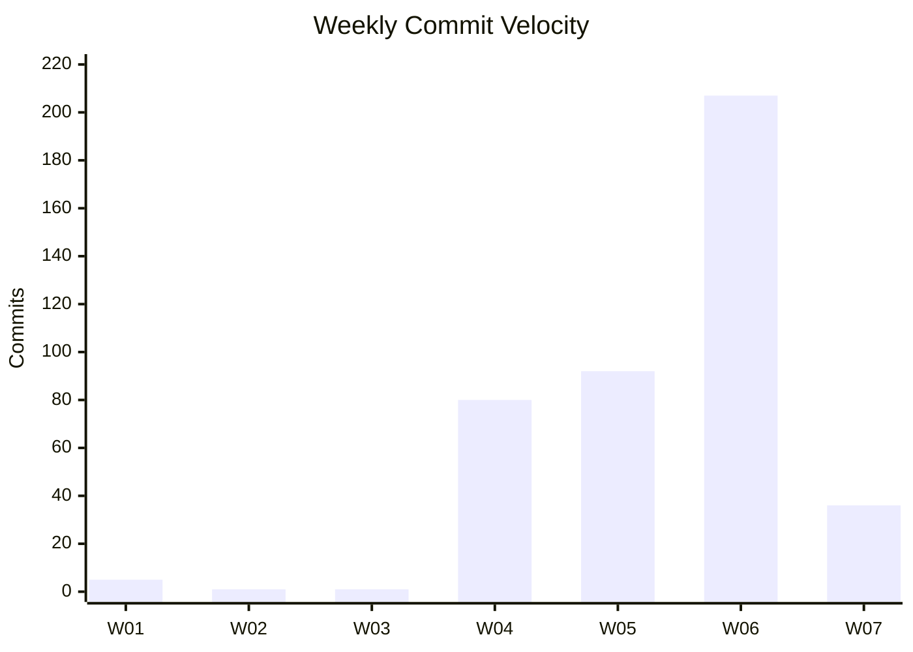
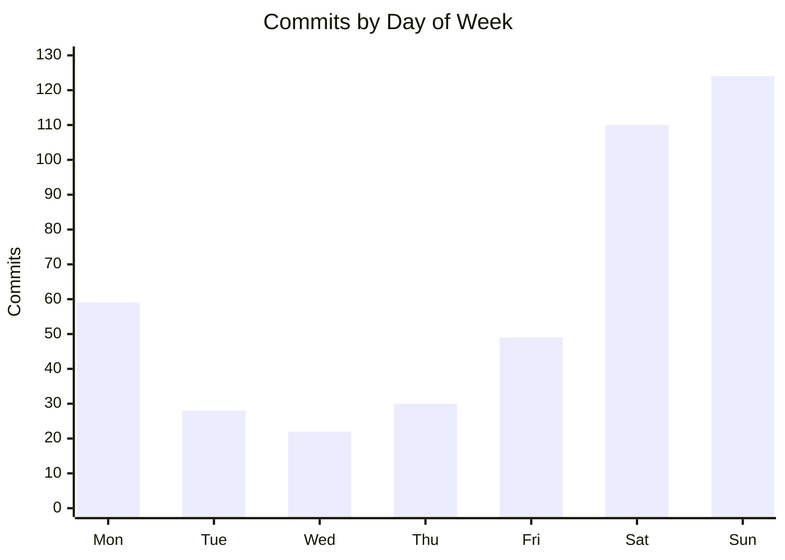
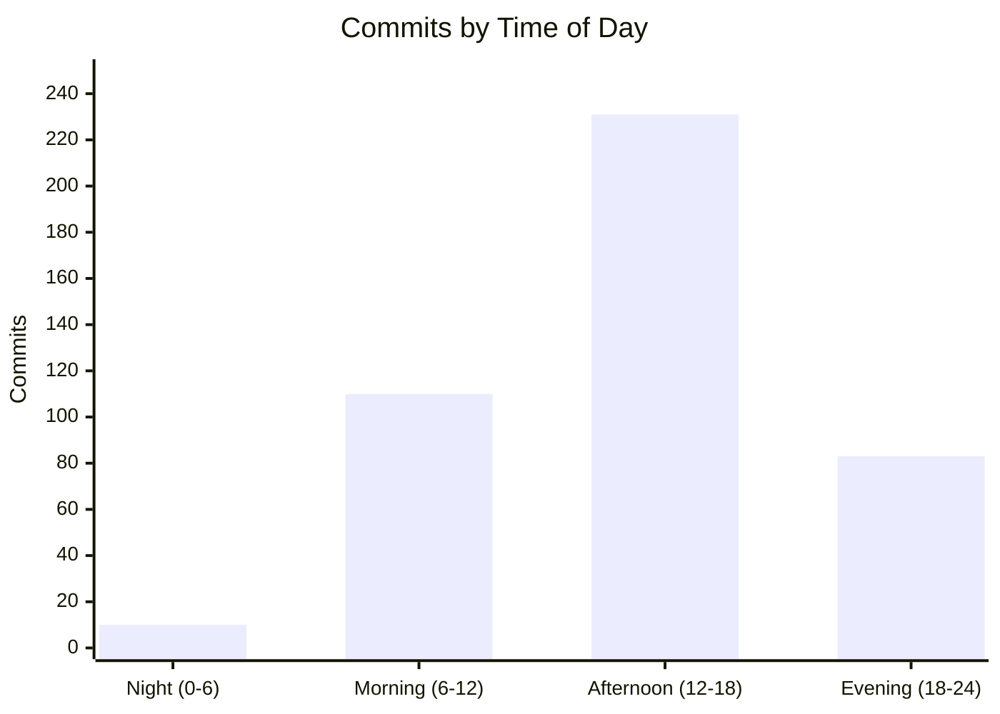
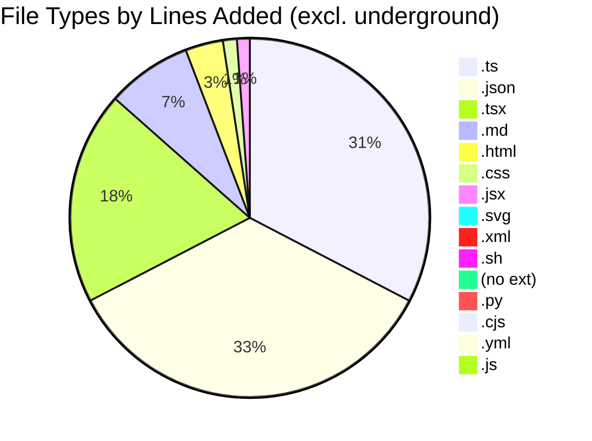

# Code Statistics Report

**Period:** January 1, 2026 - February 9, 2026
**Generated:** 2026-02-09
**Repositories Scanned:** 21

---

## Executive Summary

Development activity has surged with **428 total commits** across **11 active repositories** — up 67% from 256 commits in the previous report. Three new projects emerged as major contributors: **whiskey-canon** leads with 147 commits and 41 merged PRs (up from 85/27), **whiskey-canon-blinds** holds strong at 109 commits and 52 PRs, and two new entrants — **fusion94** (58 commits, GitHub profile repo) and **sports-card-tracker** (52 commits, 6 PRs with a 2.3M-line cleanup) — show significant recent activity. The current **17-day commit streak** (Jan 24 – Feb 9, ongoing) and weekend-heavy pattern (54.7% of commits on Sat/Sun) continue to indicate productive personal project work. Test coverage on **whiskey-canon** remains excellent at 43.3%, now with Codecov integration active.

---

## Summary

| Metric | Total |
|--------|-------|
| **Active Repositories** | 11 |
| **Inactive Repositories** | 10 |
| **Total Commits** | 428 |
| **Total Lines Added** | 1,686,566 |
| **Total Lines Removed** | 2,572,472 |
| **Net Lines Changed** | -885,906 |
| **Total Merged PRs** | 119 |
| **Avg Commits/Day** | 11.0 |
| **Avg Commits/Week** | 76.8 |

> **Note:** The net negative line count is primarily from **sports-card-tracker** PR #32, which removed ~2.37M lines of vendored dependencies in a cleanup operation.

---

## Test vs Application Code Breakdown

| Category | Lines Added | % Added | Lines Removed | % Removed | Net Change |
|----------|-------------|---------|---------------|-----------|------------|
| **Application Code** | 1,661,544 | 98.5% | 2,530,119 | 98.4% | -868,575 |
| **Test Code** | 25,022 | 1.5% | 42,353 | 1.6% | -17,331 |
| **Total** | 1,686,566 | 100% | 2,572,472 | 100% | -885,906 |

> **Excluding `underground` bulk import (1.5M+ lines) and `sports-card-tracker` bulk cleanup (2.3M lines removed)**, the adjusted breakdown is:

| Category | Lines Added | % Added | Lines Removed | % Removed | Net Change |
|----------|-------------|---------|---------------|-----------|------------|
| **Application Code** | 105,056 | 88.3% | 49,241 | 99.2% | +55,815 |
| **Test Code** | 13,916 | 11.7% | 391 | 0.8% | +13,525 |
| **Total** | 118,972 | 100% | 49,632 | 100% | +69,340 |

---

## Weekly Velocity

| Week | Dates | Commits | Merged PRs |
|------|-------|---------|------------|
| W01 | Dec 29 – Jan 4 | 5 | — |
| W02 | Jan 5 – Jan 11 | 1 | — |
| W03 | Jan 12 – Jan 18 | 1 | — |
| W04 | Jan 19 – Jan 25 | 80 | — |
| W05 | Jan 26 – Feb 1 | 92 | — |
| W06 | Feb 2 – Feb 8 | 207 | — |
| W07 | Feb 9 (partial) | 36 | — |

> **Note:** PR merge counts are aggregated at the repo level (see Active Repositories table) rather than per-week due to GitHub API limitations on date-range filtering.

---

## Activity Patterns

### Day of Week

| Day | Commits | % of Total |
|-----|---------|------------|
| Sunday | 124 | 29.0% |
| Saturday | 110 | 25.7% |
| Monday | 59 | 13.8% |
| Friday | 49 | 11.4% |
| Thursday | 30 | 7.0% |
| Tuesday | 28 | 6.5% |
| Wednesday | 22 | 5.1% |

> Weekend activity (54.7%) significantly exceeds weekday activity (43.8%), consistent with personal/side-project development patterns.

### Time of Day

| Time Bucket | Commits | % of Total |
|-------------|---------|------------|
| Morning (6–12) | 110 | 25.7% |
| Afternoon (12–18) | 231 | 54.0% |
| Evening (18–24) | 83 | 19.4% |
| Night (0–6) | 10 | 2.3% |

### Commit Streak

| Metric | Value |
|--------|-------|
| **Longest Streak** | 17 consecutive days |
| **Streak Period** | Jan 24 – Feb 9 (ongoing) |

---

## Active Repositories (sorted by commits, descending)

| Repository | Commits | App Lines + | Test Lines + | Total + | Total - | Net Change | Merged PRs |
|------------|---------|-------------|--------------|---------|---------|------------|------------|
| whiskey-canon | 147 (34.3%) | 13,915 | 10,647 | 24,562 | 1,308 | +23,254 | 41 |
| whiskey-canon-blinds | 109 (25.5%) | 51,336 | 3,269 | 54,605 | 7,500 | +47,105 | 52 |
| fusion94 | 58 (13.6%) | 1,519 | 0 | 1,519 | 528 | +991 | 0 |
| sports-card-tracker | 52 (12.1%) | 11,937 | 6,203 | 18,140 | 2,372,165 | -2,354,025 | 6 |
| rims | 40 (9.3%) | 24,935 | 0 | 24,935 | 36,128 | -11,193 | 20 |
| StringAlong | 9 (2.1%) | 1,075 | 0 | 1,075 | 1,175 | -100 | 0 |
| underground | 5 (1.2%) | 1,544,551 | 4,903 | 1,549,454 | 150,049 | +1,399,405 | 0 |
| fusion94.org | 4 (0.9%) | 6,114 | 0 | 6,114 | 3,434 | +2,680 | 0 |
| damagelabs-www | 2 (0.5%) | 5,358 | 0 | 5,358 | 9 | +5,349 | 0 |
| claude-cards | 1 (0.2%) | 676 | 0 | 676 | 0 | +676 | 0 |
| collectorsplaybook | 1 (0.2%) | 128 | 0 | 128 | 176 | -48 | 0 |

> **Note:** `underground` shows 1.5M+ lines added, indicating bulk imports or generated files. `sports-card-tracker` shows 2.3M lines removed from a vendored dependency cleanup (PR #32).

---

## Test Coverage by Repository

| Repository | Test Lines Added | App Lines Added | Test % of Added | Notes |
|------------|------------------|-----------------|-----------------|-------|
| whiskey-canon | 10,647 | 13,915 | 43.3% | Strong test investment; Codecov integrated |
| sports-card-tracker | 6,203 | 11,937 | 34.2% | Good test coverage on new code |
| whiskey-canon-blinds | 3,269 | 51,336 | 6.0% | |
| underground | 4,903 | 1,544,551 | 0.3% | Bulk import skews ratio |
| rims | 0 | 24,935 | 0.0% | 205 test lines removed |
| StringAlong | 0 | 1,075 | 0.0% | |
| fusion94 | 0 | 1,519 | 0.0% | Profile/config repo |
| fusion94.org | 0 | 6,114 | 0.0% | Static site |
| damagelabs-www | 0 | 5,358 | 0.0% | |
| collectorsplaybook | 0 | 128 | 0.0% | |
| claude-cards | 0 | 676 | 0.0% | |

---

## Code Quality Signals

| Repository | Avg PR Size (lines) | Commit:PR Ratio | Flag |
|------------|---------------------|-----------------|------|
| sports-card-tracker | 398,128.5 | 8.7:1 | ⚠ Bulk cleanup PR skews avg |
| rims | 3,566.0 | 2.0:1 | ⚠ Large PRs |
| whiskey-canon-blinds | 898.3 | 2.1:1 | ⚠ Large PRs |
| whiskey-canon | 603.3 | 3.6:1 | ⚠ Large PRs |

> Repos with avg PR size > 500 lines may benefit from smaller, more focused pull requests. **sports-card-tracker** avg is heavily skewed by PR #32 (2.38M lines removed in a cleanup).

### File Types by Repository (top extensions by lines added)

| Repository | Primary Types |
|------------|--------------|
| whiskey-canon | .ts (11,556), .tsx (5,871), .json (3,389), .md (1,520) |
| whiskey-canon-blinds | .json (19,145), .ts (18,716), .tsx (10,795), .md (5,562) |
| rims | .json (12,495), .tsx (7,767), .ts (3,517) |
| sports-card-tracker | .ts (9,032), .json (6,740), .md (1,108), .tsx (717) |
| fusion94 | .svg (1,279), .yml (135), .md (105) |
| fusion94.org | .html (4,254), .xml (952), .md (872) |
| damagelabs-www | .json (3,724), .jsx (1,299), .js (184) |

---

## Collaboration Metrics

| Repository | Avg PR Turnaround | Avg Comments/PR | Unique Reviewers | Bus Factor |
|------------|-------------------|-----------------|------------------|------------|
| whiskey-canon | 47m 3s | 0.6 | 2 | 2 |
| sports-card-tracker | 2h 6m | 0.0 | 0 | 1 |
| rims | 4m 49s | 0.0 | 0 | 1 |
| whiskey-canon-blinds | < 1m | 0.0 | 0 | 1 |
| fusion94 | — | — | — | 2 |
| StringAlong | — | — | — | 2 |
| underground | — | — | — | 1 |
| fusion94.org | — | — | — | 1 |
| damagelabs-www | — | — | — | 1 |
| collectorsplaybook | — | — | — | 1 |
| claude-cards | — | — | — | 1 |

> **whiskey-canon** is the only repo with meaningful PR review activity (2 unique reviewers including Copilot, 0.6 avg comments from Codecov). Most repos have a bus factor of 1, indicating single-contributor projects.

---

## Repo Health Dashboard

| Repository | Last Commit | Open Issues | Open PRs | Branches | Flags |
|------------|-------------|-------------|----------|----------|-------|
| whiskey-canon | Feb 9, 2026 | 35 | 0 | 38 | ⚠ 35 issues, 38 branches |
| sports-card-tracker | Feb 9, 2026 | 25 | 0 | 7 | ⚠ 25 issues |
| fusion94 | Feb 8, 2026 | 0 | 0 | 2 | |
| rims | Feb 3, 2026 | 2 | 0 | 12 | ⚠ 12 branches |
| whiskey-canon-blinds | Feb 1, 2026 | 1 | 0 | 6 | |
| StringAlong | Jan 29, 2026 | 0 | 0 | 2 | |
| underground | Jan 28, 2026 | 0 | 0 | 2 | |
| damagelabs-www | Jan 20, 2026 | 0 | 0 | 2 | |
| claude-cards | Jan 20, 2026 | 0 | 0 | 2 | |
| fusion94.org | Jan 15, 2026 | 0 | 0 | 2 | |
| collectorsplaybook | Jan 6, 2026 | 0 | 0 | 3 | |
| PRDs | Dec 30, 2025 | 0 | 0 | 2 | |
| Cards/sports-card-tracker | Aug 5, 2025 | 0 | 0 | 2 | |
| dory/dory-clone | Aug 15, 2025 | 0 | 0 | 0 | No remote |
| recipe-planner/recipe-planner | Aug 18, 2025 | 0 | 0 | 0 | No remote |
| gunken.io | Jul 31, 2025 | 0 | 0 | 2 | |
| Go-FilamentSamples | Jun 17, 2025 | 1 | 0 | 4 | |
| image-processing | Jun 18, 2025 | 0 | 0 | 2 | |
| banderaskyworks | Jun 16, 2025 | 0 | 0 | 3 | |
| goalert | Apr 2, 2025 | 146 | 30 | 126 | ⚠ 146 issues, 30 open PRs, 126 branches |
| fitbit2garmin | Dec 17, 2023 | 6 | 1 | 9 | ⚠ 6 issues, stale (2+ years) |

> **whiskey-canon** has grown to 35 open issues and 38 remote branches — may need branch cleanup and issue triage. **sports-card-tracker** has 25 open issues representing a backlog of planned features. **goalert** (fork of target/goalert) issues/PRs/branches reflect upstream activity.

---

## File Type Distribution

| Extension | Lines Added | % of Total |
|-----------|-------------|------------|
| `.js` | 1,215,592 | 72.1% |
| `.ts` | 188,886 | 11.2% |
| `.md` | 127,253 | 7.5% |
| `.json` | 66,968 | 4.0% |
| `.tsx` | 38,159 | 2.3% |
| `.flow` | 12,423 | 0.7% |
| `.cjs` | 7,635 | 0.5% |
| `.mjs` | 6,159 | 0.4% |
| (no ext) | 6,068 | 0.4% |
| `.html` | 4,493 | 0.3% |
| `.svg` | 1,344 | 0.1% |
| `.jsx` | 3,326 | 0.2% |
| `.css` | 1,643 | 0.1% |
| `.xml` | 952 | 0.1% |
| Other | 5,665 | 0.3% |

> **Excluding `underground`** (which adds 1.2M `.js` lines), TypeScript (`.ts` + `.tsx`) dominates at 49.5% of remaining lines added.

---

## Inactive Repositories (no activity since Jan 1, 2026)

| Repository | GitHub Org/Owner | Last Commit |
|------------|------------------|-------------|
| PRDs | DamageLabs | Dec 30, 2025 |
| Cards/sports-card-tracker | Collectors-Playbook | Aug 5, 2025 |
| dory/dory-clone | (no GitHub remote) | Aug 15, 2025 |
| recipe-planner/recipe-planner | (no GitHub remote) | Aug 18, 2025 |
| gunken.io | fusion94 | Jul 31, 2025 |
| Go-FilamentSamples | fusion94 | Jun 17, 2025 |
| image-processing | Collectors-Playbook | Jun 18, 2025 |
| banderaskyworks | Bandera-Skyworks | Jun 16, 2025 |
| goalert | target (fork) | Apr 2, 2025 |
| fitbit2garmin | simonepri (fork) | Dec 17, 2023 |

---

## Top Contributors

### By Commits

| Rank | Contributor | Commits | % of Total |
|------|-------------|---------|------------|
| 1 | Tony Guntharp | 400 | 93.5% |
| 2 | fusion94 | 27 | 6.3% |
| 3 | copilot-swe-agent[bot] | 2 | 0.5% |

> **Note:** "Tony Guntharp" and "fusion94" are the same person with different git author configs (local vs GitHub-authored commits).

### By Lines Added

| Rank | Contributor | Lines Added | % of Total |
|------|-------------|-------------|------------|
| 1 | Tony Guntharp | 1,686,519 | 99.99% |
| 2 | fusion94 | 40 | <0.01% |
| 3 | copilot-swe-agent[bot] | 7 | <0.01% |

### By Merged PRs

| Rank | Contributor | Merged PRs | % of Total |
|------|-------------|------------|------------|
| 1 | fusion94 | 117 | 99.2% |
| 2 | app/copilot-swe-agent | 1 | 0.8% |

---

## Most Active Projects

The top 3 projects by combined activity (commits + PRs):

1. **whiskey-canon** — 147 commits, 41 merged PRs, +23K net lines (43.3% test code). Codecov integration active with automated coverage comments on PRs.
2. **whiskey-canon-blinds** — 109 commits, 52 merged PRs, +47K net lines (6.0% test code)
3. **fusion94** — 58 commits, 0 PRs, +991 net lines (GitHub profile/config repository, all activity on Feb 6-8)

---

## Changes Since Last Report

Compared to the previous report (generated Feb 5, 2026):

| Metric | Previous | Current | Delta |
|--------|----------|---------|-------|
| Active Repositories | 9 | 11 | +2 |
| Total Commits | 256 | 428 | **+172 (+67.2%)** |
| Total Lines Added | 1,660,235 | 1,686,566 | +26,331 |
| Total Lines Removed | 199,311 | 2,572,472 | +2,373,161 |
| Total Merged PRs | 98 | 119 | **+21 (+21.4%)** |
| Avg Commits/Day | 7.3 | 11.0 | +3.7 |
| Avg Commits/Week | 51.2 | 76.8 | +25.6 |
| Longest Streak | 13 days | 17 days | +4 days |

### Key Changes
- **+2 new active repos:** `fusion94` (58 commits) and `sports-card-tracker` (52 commits) are newly active
- **whiskey-canon** surged from 85 to 147 commits (+62) and 27 to 41 PRs (+14)
- **sports-card-tracker** performed a major cleanup removing ~2.3M lines of vendored dependencies
- **W06 (Feb 2–8) was the most active week ever** with 207 commits
- **Commit streak extended** from 13 to 17 consecutive days (still ongoing)
- **Test coverage improvements:** whiskey-canon now has Codecov integration with automated PR comments

---

## Notes

- Statistics gathered from local git repositories in `/Users/guntharp/Code/`
- PR counts reflect merged pull requests on GitHub since 2026-01-01
- Line counts include all file types tracked by git
- Test files identified by directory (`test/`, `tests/`, `__tests__/`, `spec/`, `testing/`) and file naming conventions (`_test.go`, `.test.ts`, `.spec.js`, etc.)
- PR turnaround time measures creation-to-merge duration
- Bus factor = number of distinct commit authors per repo
- 2 repositories have no GitHub remote (dory/dory-clone, recipe-planner)
- `underground` bulk import (1.5M+ lines) significantly skews aggregate metrics; adjusted figures are provided where relevant
- `sports-card-tracker` PR #32 removed ~2.37M lines of vendored/generated code, heavily skewing removal metrics
- `goalert` is a fork of target/goalert — open issues/PRs/branches reflect upstream activity
- "Tony Guntharp" and "fusion94" represent the same contributor with different git author configurations
- Report generated on February 9, 2026
