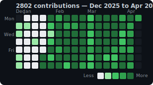
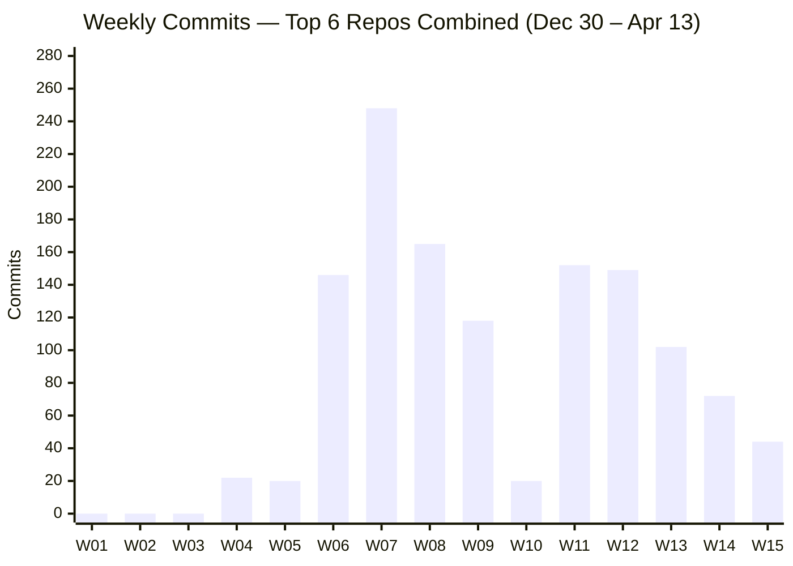
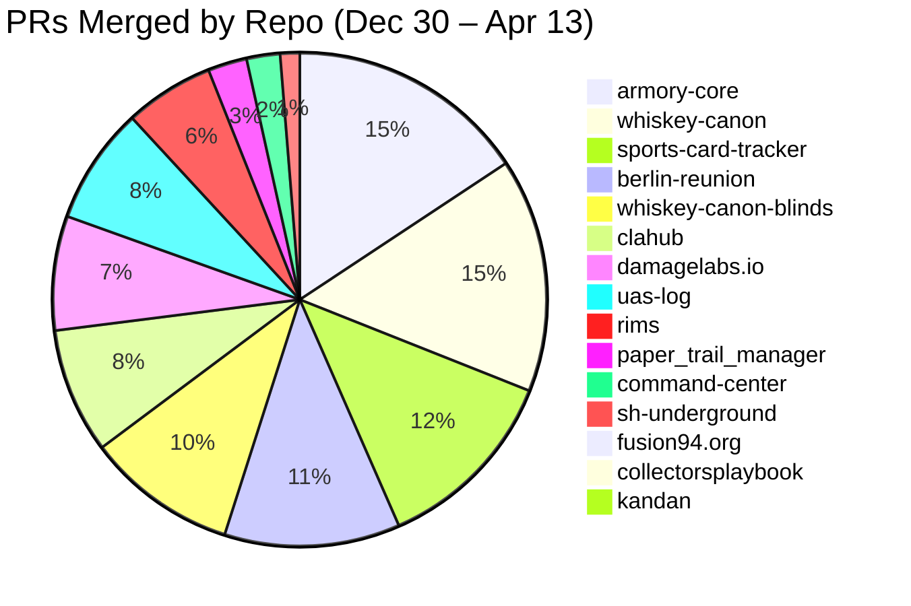
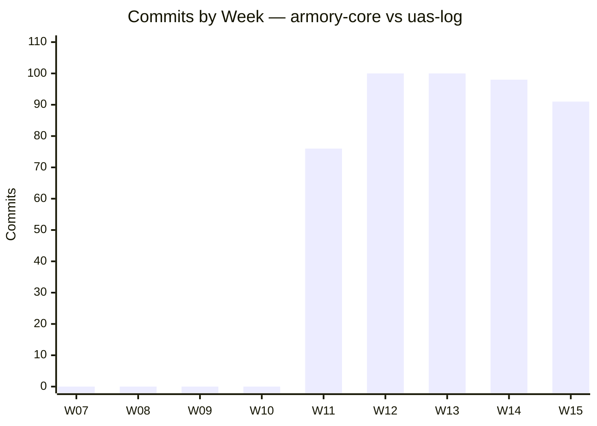

# Code Statistics Report

**Date Range:** 2025-12-30 to 2026-04-13 (105 days, ~15 weeks)
**Author:** fusion94 / DamageLabs
**Repos tracked:** 18

---

## Executive Summary

A 105-day sprint across 18 repositories producing **2,800 commits** and **557 merged PRs**. The work spanned two distinct phases: an early-stage rapid build period (Jan–Feb) where apps were scaffolded and shipped in intense 1–3 day sprints, and a maturation phase (Mar–Apr) focused on Angular migrations, live demo deployments, infrastructure standardization, and public-facing product launches.

**Top repos by commits:** armory-core (521), fusion94 stats bot (447), sports-card-tracker (315), whiskey-canon (291), berlin-reunion (265), clahub (199)

**Top repos by PRs merged:** armory-core (86), whiskey-canon (84), sports-card-tracker (68), berlin-reunion (63), whiskey-canon-blinds (54), clahub (45)

---

## Summary Table

| Metric | Value |
|--------|-------|
| Total Commits | **2,800** |
| Total PRs Merged | **557** |
| Issues Opened | **618** |
| Issues Closed | **493** |
| Lines Added | **~450,000+** |
| Lines Removed | **~120,000+** |
| Net Lines | **~330,000+** |
| Repos with active development | **18** |
| Active commit days | **86 of 105** |
| Longest commit streak | **80 days** (Jan 24 – Apr 13, ongoing 🔥) |
| Live sites deployed | **8** (damagelabs.io, cla-hub.io, fusion94.org, 5 existing) |
| Demo instances deployed | **2** (demo.armory-core.com, demo.uas-log.com) |
| Blog posts published | **14** (6 fusion94.org + 8 damagelabs.io) |
| Gems published | **4** (PTM v0.7–v1.0) |
| Test suite growth | **0 → 50** (PTM), **0 → 85+** (uas-log) |

---

## Contribution Heatmap

---

## Per-Repo Breakdown

| Repo | Commits | PRs Merged | Highlights |
|------|---------|------------|------------|
| DamageLabs/armory-core | 521 | 86 | Angular migration, E2E isolation, demo deploy |
| fusion94/fusion94 | 447 | — | GitHub stats SVG automation |
| DamageLabs/sports-card-tracker | 315 | 68 | Full app built Jan–Feb |
| DamageLabs/whiskey-canon | 291 | 84 | Features, PM2→systemd, health endpoints |
| DamageLabs/berlin-reunion | 265 | 63 | Full app built Jan–Feb |
| DamageLabs/clahub | 199 | 45 | Full revival + deployment to cla-hub.io |
| DamageLabs/whiskey-canon-blinds | 117 | 54 | PM2→systemd, deployment cleanup |
| DamageLabs/rims | 108 | 32 | Full app built, major refactor |
| DamageLabs/brain | 102 | — | Standups, docs, agent configs, infra notes |
| DamageLabs/damagelabs.io | 96 | 41 | Blog, portfolio, contact form, live deploy |
| DamageLabs/uas-log | 143 | 42 | Full 4-phase platform, RBAC, GPS tracks, demo |
| DamageLabs/command-center | 61 | 12 | 10-tab dashboard shipped |
| DamageLabs/paper_trail_manager | 36 | 14 | v1.0.0 on RubyGems |
| fusion94/fusion94.org | 41 | 5 | Jekyll→Astro migration |
| DamageLabs/sh-underground | 33 | 7 | PM2→systemd, health endpoint |
| DamageLabs/stringalong | 11 | 0 | Minor updates |
| DamageLabs/collectorsplaybook | 10 | 3 | Favicon, Umami, blog SEO fixes |
| DamageLabs/kandan | 4 | 1 | Angular scaffold |

---

## Weekly Activity (Top 6 Repos Combined)

```mermaid
xychart-beta
  title "Weekly Commits — Top 6 Repos Combined (Dec 30 – Apr 13)"
  x-axis ["W01", "W02", "W03", "W04", "W05", "W06", "W07", "W08", "W09", "W10", "W11", "W12", "W13", "W14", "W15"]
  y-axis "Commits" 0 --> 280
  bar [0, 0, 0, 22, 20, 146, 248, 165, 118, 20, 152, 149, 102, 72, 44]
```

---

## PRs Merged by Repo

```mermaid
pie title PRs Merged by Repo (Dec 30 – Apr 13)
  "armory-core" : 86
  "whiskey-canon" : 84
  "sports-card-tracker" : 68
  "berlin-reunion" : 63
  "whiskey-canon-blinds" : 54
  "clahub" : 45
  "damagelabs.io" : 41
  "uas-log" : 42
  "rims" : 32
  "paper_trail_manager" : 14
  "command-center" : 12
  "sh-underground" : 7
  "fusion94.org" : 5
  "collectorsplaybook" : 3
  "kandan" : 1
```

---

## Commit Activity by Phase

```mermaid
xychart-beta
  title "Commits by Week — armory-core vs uas-log"
  x-axis ["W07", "W08", "W09", "W10", "W11", "W12", "W13", "W14", "W15"]
  y-axis "Commits" 0 --> 110
  bar [0, 0, 0, 0, 76, 100, 100, 98, 91]
```

---

## Major Milestones by Month

### December 30 – January (W01–W04)
- Initial repo scaffolding: stringalong, fusion94.org tweaks

### January (W04–W07) — Rapid Build Phase
- **sports-card-tracker** built (315 commits, 68 PRs) — full trading card management app
- **whiskey-canon** heavy development (291 commits, 84 PRs)
- **berlin-reunion** built (265 commits, 63 PRs)
- **rims** built and refactored (108 commits, 32 PRs)
- **whiskey-canon-blinds** (117 commits, 54 PRs)

### February (W06–W09) — Infra + New Builds
- **CLAHub** revived and deployed to cla-hub.io (199 commits, 45 PRs)
- **Paper Trail Manager 1.0.0** released to RubyGems — 14 years after creation
- **damagelabs.io** built and deployed live — 41 PRs, screenshots, blog, contact form
- **Umami analytics** deployed at analytics.damagelabs.io
- GCP VM standardized: 4 Node apps PM2 → systemd

### March (W11–W13) — uas-log + armory-core Angular
- **uas-log** entire 4-phase platform built overnight (200 issues closed, Mar 12-13)
- **uas-log RBAC** system: schema, middleware, data isolation, org management (7 PRs)
- **armory-core** Angular/Tailwind migration — full frontend rewrite from React/CoreUI
- **fusion94.org** Jekyll → Astro migration with GitHub Actions deploy
- **command-center** 10-tab engineering dashboard (30 issues closed in one week)

### April (W14–W15) — Demo Deployments + Polish
- **demo.armory-core.com** deployed to GCP (port 3007) with auto-reseed
- **demo.uas-log.com** deployed to GCP (port 3008), 2-hour reset, 270+ flights + GPS tracks
- **armory-core** React frontend removed (162 files, PR #245)
- **uas-log** GPS track visualization on map with altitude color gradient
- **DGX Spark** (GB10, 121 GiB) set up with OpenClaw + Qwen3 14B + Atlas agent
- **collectorsplaybook** transferred to DamageLabs, Umami added, blog SEO fixed

---

## Infrastructure Milestones

| Date | Milestone |
|------|-----------|
| Mar 16 | GCP VM fully standardized — PM2 → systemd for all 4 Node apps |
| Mar 17 | damagelabs.io live at production |
| Mar 18 | CLAHub live at cla-hub.io |
| Mar 18 | Umami analytics live at analytics.damagelabs.io |
| Mar 18 | PTM v1.0.0 published to RubyGems |
| Mar 19 | fusion94.org migrated Jekyll → Astro |
| Apr 4 | demo.armory-core.com live on GCP |
| Apr 8 | DGX Spark online — OpenClaw + Qwen3 14B + GPT-5.4 |
| Apr 11 | demo.uas-log.com live on GCP |
| Apr 13 | collectorsplaybook.com updated — Umami, favicon, blog SEO |

---

**Report generated:** 2026-04-13
**Previous reports:** code-stats-2026-02-25.md, code-stats-2026-02-13.md, code-stats-2026-02-10.md
