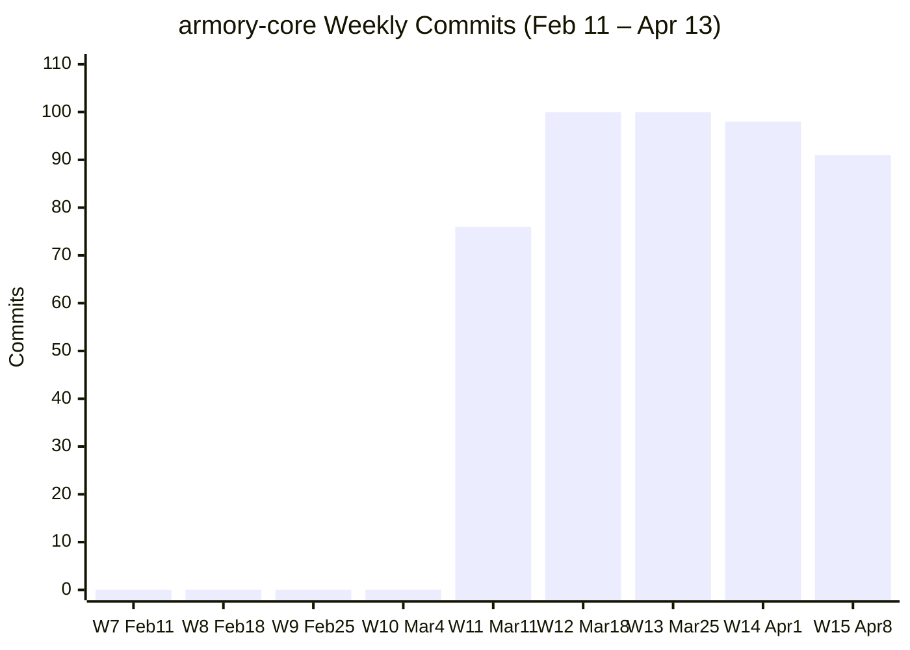
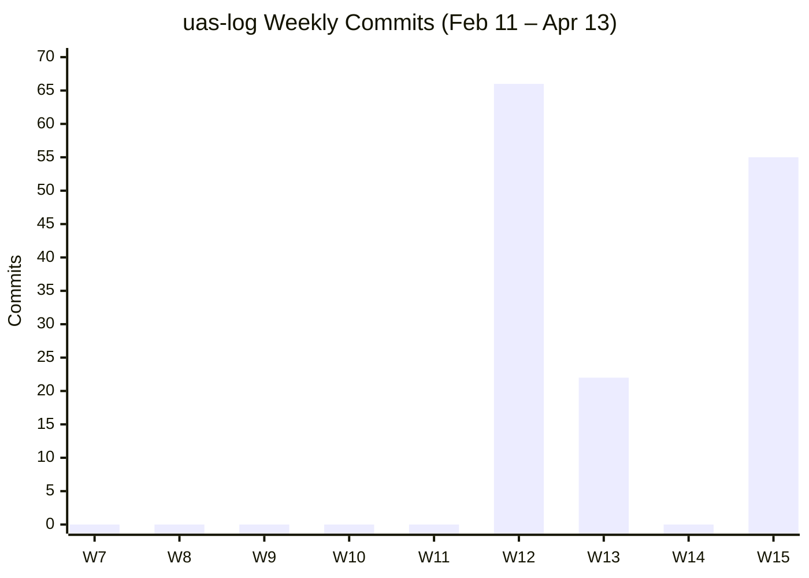
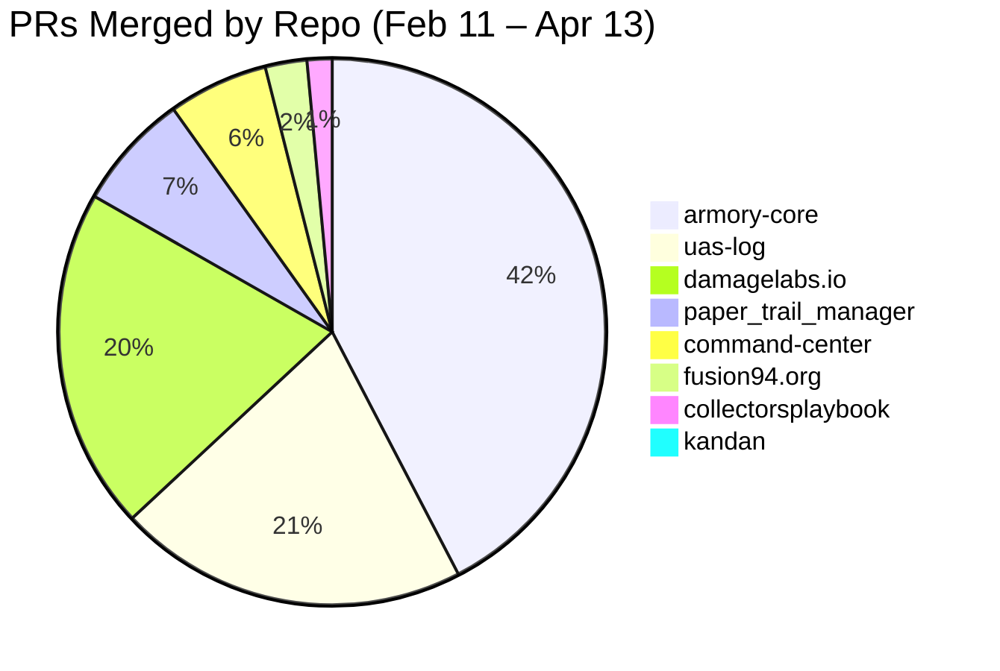

# Code Statistics Report

**Date Range:** 2026-02-11 to 2026-04-13 (61 days, ~8.7 weeks)
**Author Filter:** fusion94 / DamageLabs
**Previous Report:** 2026-02-10

---

## Executive Summary

A massive 61-day sprint that transformed DamageLabs from a handful of early-stage apps into a full product suite with live demo deployments. **armory-core** dominated with 465 commits — a full Angular frontend migration, E2E test isolation, TypeScript fixes, and public demo at demo.armory-core.com. **uas-log** shipped 143 commits including an entire 4-phase platform build overnight, RBAC, GPS track visualization, and a live demo at demo.uas-log.com. **damagelabs.io** and **fusion94.org** received 96 and 36 commits respectively. Total merged PRs across all repos: **204**.

---

## Summary Table

| Metric | Value |
|--------|-------|
| Total Commits (tracked repos) | **1,324** |
| Total PRs Merged | **204** |
| Repos with active development | **8** |
| New live deployments | **3** (demo.armory-core.com, demo.uas-log.com, command.test) |
| Open issues EOD | **7** (across all repos) |

---

## Per-Repo Breakdown

| Repo | Commits | PRs Merged | Open Issues | Highlights |
|------|---------|------------|-------------|------------|
| DamageLabs/armory-core | 465 | 86 | 1 | Angular migration, E2E, demo deploy |
| fusion94/fusion94 | 372 | — | 0 | GitHub stats SVG automation |
| DamageLabs/uas-log | 143 | 42 | 1 | Full platform build, RBAC, GPS tracks, demo |
| DamageLabs/brain | 102 | — | 1 | Standups, docs, agent configs |
| DamageLabs/damagelabs.io | 96 | 41 | 0 | Blog posts, portfolio, contact form |
| DamageLabs/command-center | 61 | 12 | 1 | 10-tab dashboard shipped |
| DamageLabs/paper_trail_manager | 36 | 14 | 1 | 1.0.0 released to RubyGems |
| fusion94/fusion94.org | 36 | 5 | 1 | Jekyll → Astro migration |
| DamageLabs/kandan | 4 | 1 | 1 | Angular scaffold |
| DamageLabs/collectorsplaybook | 9 | 3 | 1 | Favicon, Umami, blog SEO |

---

## Weekly Commit Activity

### armory-core (465 commits)

```mermaid
xychart-beta
  title "armory-core Weekly Commits (Feb 11 – Apr 13)"
  x-axis ["W7 Feb11", "W8 Feb18", "W9 Feb25", "W10 Mar4", "W11 Mar11", "W12 Mar18", "W13 Mar25", "W14 Apr1", "W15 Apr8"]
  y-axis "Commits" 0 --> 110
  bar [0, 0, 0, 0, 76, 100, 100, 98, 91]
```

### uas-log (143 commits)

```mermaid
xychart-beta
  title "uas-log Weekly Commits (Feb 11 – Apr 13)"
  x-axis ["W7", "W8", "W9", "W10", "W11", "W12", "W13", "W14", "W15"]
  y-axis "Commits" 0 --> 70
  bar [0, 0, 0, 0, 0, 66, 22, 0, 55]
```

---

## PRs Merged by Repo

```mermaid
pie title PRs Merged by Repo (Feb 11 – Apr 13)
  "armory-core" : 86
  "uas-log" : 42
  "damagelabs.io" : 41
  "paper_trail_manager" : 14
  "command-center" : 12
  "fusion94.org" : 5
  "collectorsplaybook" : 3
  "kandan" : 1
```

---

## Major Milestones This Period

### armory-core
- Full React/CoreUI → Angular/Tailwind frontend migration (107 files deleted, PR #245)
- TypeScript build errors resolved (37 errors, PR #243)
- E2E test isolation — dedicated `test-armory.db` (PR #238)
- demo.armory-core.com deployed to GCP (port 3007)
- Demo seed: 2 orgs, 9 users, 270+ flights with GPS tracks

### uas-log
- Entire 4-phase platform built overnight (200 issues closed, Mar 12-13)
- RBAC system: schema, middleware, data isolation, org management (7 PRs, Mar 15)
- GPS track storage + flight path visualization on map (PR #281)
- CSRF interceptor for production (PR #288)
- demo.uas-log.com deployed to GCP (port 3008) with 2-hour auto-reset

### damagelabs.io
- 41 PRs merged — blog posts, portfolio, product screenshots (17 across 5 products)
- Contact form (Resend integration)
- Live at damagelabs.io

### paper_trail_manager
- v1.0.0 released to RubyGems (14 years after initial creation)
- 12 issues closed, 50 tests, CI green

### command-center
- 10-tab engineering dashboard shipped from zero (30 issues closed in one week)
- Tabs: Home, GitHub, Calendar, Obsidian notes, Standup, Repos, Issues, Analytics

### fusion94.org
- Jekyll → Astro migration with GitHub Actions deploy
- Dark theme, hero redesign, Week One blog post

### collectorsplaybook
- Transferred to DamageLabs org
- Caddy local dev at collectorsplaybook.test
- GA4 replaced with Umami analytics
- Favicon added, OG image fixed, static blog posts for SEO

---

## Infrastructure Milestones

- GCP VM standardized: 4 Node apps PM2 → systemd (Mar 16)
- Umami analytics deployed (analytics.damagelabs.io, port 3005)
- 6 local `.test` domains via Caddy reverse proxy
- DGX Spark (GB10, 121 GiB) set up with OpenClaw + Qwen3 14B (Apr 8)
- Atlas agent running on Spark with GPT-5.4 + local Qwen3 14B

---

## Running Totals (All-Time through Apr 13, 2026)

| Metric | Value |
|--------|-------|
| Lifetime commits (tracked) | ~1,700+ |
| Lifetime PRs merged | ~327+ |
| Live deployments | 8 sites + 2 demo instances |
| Gems published | 4 (PTM v0.7–v1.0) |

---

**Report generated:** 2026-04-13
**Previous reports:** code-stats-2026-02-25.md, code-stats-2026-02-13.md, code-stats-2026-02-10.md
